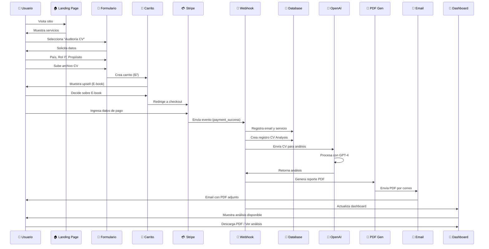
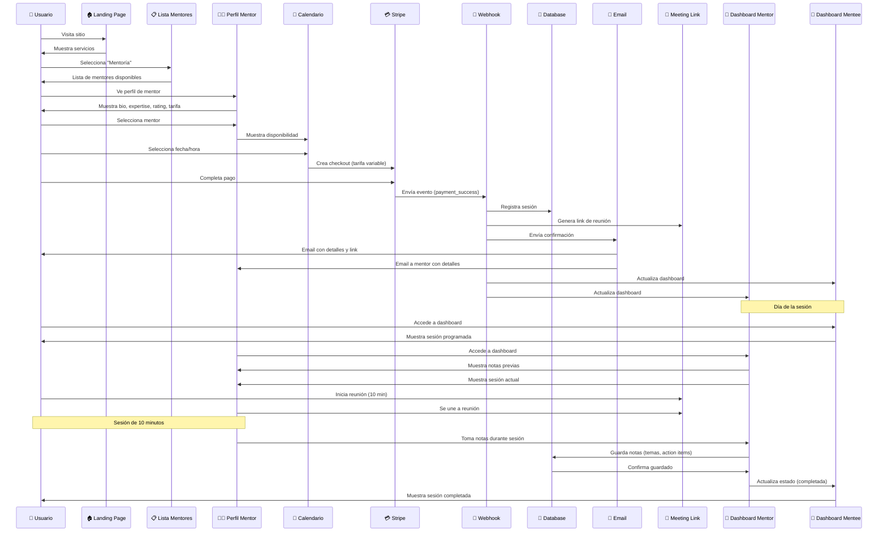
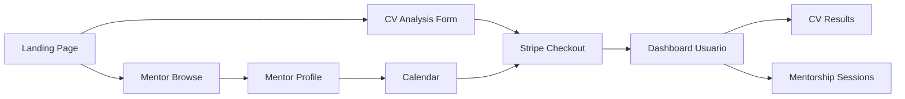
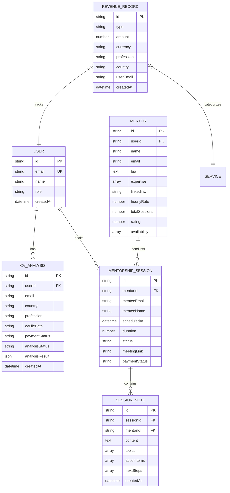
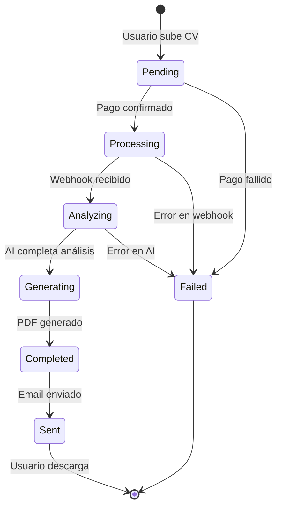
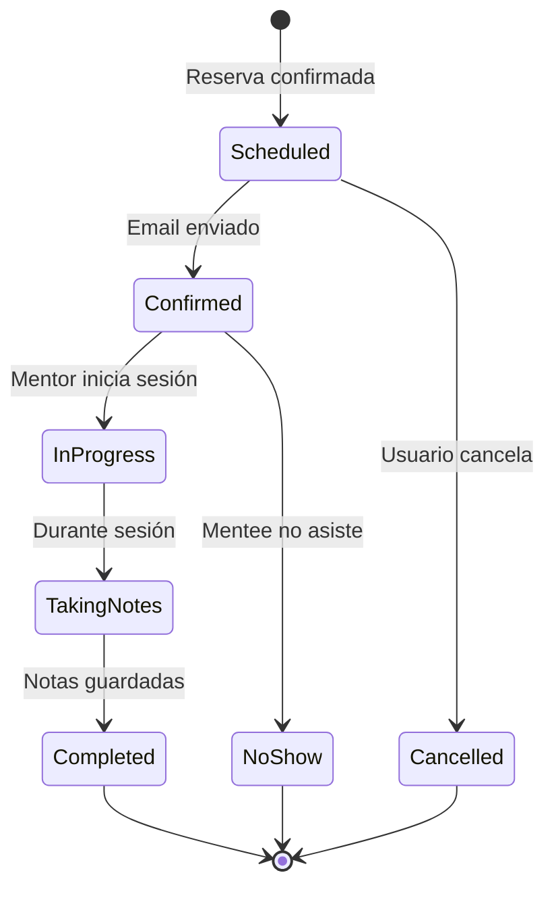
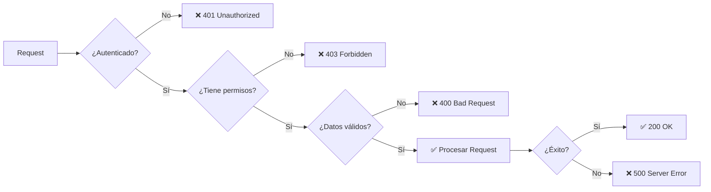
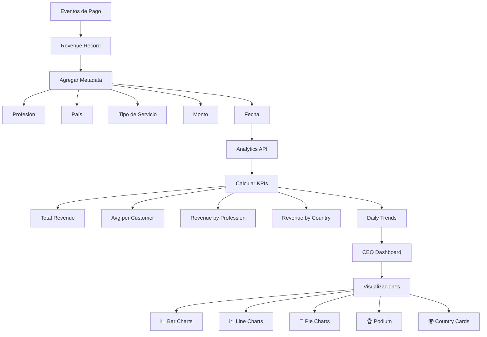
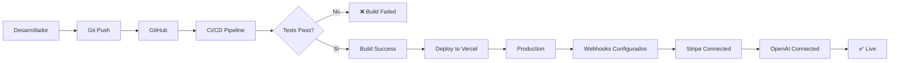

# 📊 Diagrama de Flujo del Servicio - SkillsForIT

## 🎯 Flujo Principal de Usuario

```mermaid
flowchart TD
    A[🏠 Landing Page] --> B{¿Qué servicio elige?}
    
    B -->|Auditoría de CV| C[📝 Formulario CV]
    B -->|Mentoría 1:1| D[👨‍🏫 Explorar Mentores]
    
    C --> E[Ingresa Datos]
    E --> E1[País: Dropdown]
    E --> E2[Rol IT: Dropdown]
    E --> E3[Propósito: Texto]
    E --> E4[📎 Subir archivo CV]
    
    E4 --> F[🛒 Carrito]
    F --> F1[💰 Precio: USD $7]
    F --> F2[📚 Upsell: E-book Sugerido]
    
    F2 --> G{¿Acepta E-book?}
    G -->|Sí| H[Total: $7 + E-book]
    G -->|No| I[Total: $7]
    
    H --> J[💳 Stripe Checkout]
    I --> J
    
    J --> K{¿Pago exitoso?}
    K -->|No| L[❌ Error de Pago]
    L --> F
    
    K -->|Sí| M[✅ Webhook Stripe]
    M --> N[💾 Registrar en BD]
    N --> N1[Guardar Email]
    N --> N2[Segmentar Servicio]
    N --> N3[Crear Registro CV]
    
    N3 --> O[🔄 Pantalla: Generando Reporte...]
    O --> P[🤖 OpenAI GPT-4]
    P --> P1[Analiza CV]
    P --> P2[Score ATS]
    P --> P3[Recomendaciones]
    
    P3 --> Q[📄 Generar PDF]
    Q --> R[📧 Enviar por Email]
    R --> S[✅ Descarga Disponible]
    S --> T[👤 Dashboard Usuario]
    T --> T1[Ver Análisis]
    T --> T2[Descargar PDF]
    T --> T3[Historial]
    
    D --> U[📋 Lista de Mentores]
    U --> V[Ver Perfil Mentor]
    V --> V1[Bio y Experiencia]
    V --> V2[Expertise Areas]
    V --> V3[⭐ Rating & Reviews]
    V --> V4[💵 Tarifa/hora]
    
    V4 --> W{¿Selecciona Mentor?}
    W -->|No| U
    W -->|Sí| X[📅 Ver Disponibilidad]
    
    X --> Y[Seleccionar Fecha/Hora]
    Y --> Z[🛒 Confirmar Reserva]
    Z --> AA[💳 Stripe Checkout]
    
    AA --> AB{¿Pago exitoso?}
    AB -->|No| AC[❌ Error de Pago]
    AC --> Z
    
    AB -->|Sí| AD[✅ Webhook Stripe]
    AD --> AE[💾 Registrar Sesión]
    AE --> AE1[Guardar Email]
    AE --> AE2[Crear Sesión]
    AE --> AE3[Generar Meeting Link]
    
    AE3 --> AF[📧 Email Confirmación]
    AF --> AF1[Link de Zoom/Meet]
    AF --> AF2[Fecha y Hora]
    AF --> AF3[Datos del Mentor]
    
    AF3 --> AG[👤 Dashboard Mentee]
    AG --> AG1[Sesiones Programadas]
    AG --> AG2[Unirse a Reunión]
    AG --> AG3[Historial]
    
    AF3 --> AH[👨‍🏫 Dashboard Mentor]
    AH --> AH1[Ver Sesiones]
    AH --> AH2[📝 Ver Notas Previas]
    AH --> AH3[Iniciar Reunión]
    
    AH3 --> AI[💬 Sesión 10 min]
    AI --> AJ[✍️ Tomar Notas]
    AJ --> AJ1[Temas Discutidos]
    AJ --> AJ2[Action Items]
    AJ --> AJ3[Próximos Pasos]
    
    AJ3 --> AK[💾 Guardar Notas]
    AK --> AL[✅ Sesión Completada]
    AL --> AG
    AL --> AH

    style A fill:#818cf8,stroke:#4f46e5,stroke-width:3px,color:#fff
    style B fill:#f59e0b,stroke:#d97706,stroke-width:2px
    style J fill:#10b981,stroke:#059669,stroke-width:2px
    style AA fill:#10b981,stroke:#059669,stroke-width:2px
    style P fill:#8b5cf6,stroke:#7c3aed,stroke-width:2px
    style Q fill:#ec4899,stroke:#db2777,stroke-width:2px
    style S fill:#10b981,stroke:#059669,stroke-width:3px,color:#fff
    style AL fill:#10b981,stroke:#059669,stroke-width:3px,color:#fff
```



## 🔄 Flujos Detallados por Servicio

### 1️⃣ Auditoría de CV (CV Analysis Flow)



### 2️⃣ Mentoría 1:1 (Mentorship Flow)



## 🎨 Componentes del Sistema

### Frontend (Next.js 14)


### Backend (API Routes)
```mermaid
graph TD
    A[API Routes] --> B[/api/webhook]
    A --> C[/api/analyze]
    A --> D[/api/admin/analytics]
    A --> E[/api/mentors]
    A --> F[/api/sessions]
    
    B --> G[Stripe Events]
    C --> H[OpenAI Integration]
    D --> I[Revenue Analytics]
    E --> J[Mentor Management]
    F --> K[Session Management]
```

### Base de Datos (In-Memory)


## 📊 Estados del Sistema

### Estados de CV Analysis


### Estados de Mentorship Session


## 🔐 Seguridad y Validación



## 📈 Integración con Analytics (CEO Dashboard)



## 🎯 Rutas de Usuario

### Ruta: Nuevo Usuario → Análisis CV
```
1. / (Landing)
2. /upload (Formulario)
3. /checkout (Stripe)
4. /dashboard (Resultados)
5. /dashboard/download (Descargar PDF)
```

### Ruta: Nuevo Usuario → Mentoría
```
1. / (Landing)
2. /mentors (Browse)
3. /mentors/[id] (Perfil)
4. /mentors/[id]/book (Calendario)
5. /checkout (Stripe)
6. /dashboard (Sesiones)
7. /dashboard/sessions/[id] (Detalles)
```

### Ruta: Mentor
```
1. /mentor/register (Registro)
2. /mentor/dashboard (Dashboard)
3. /mentor/sessions (Lista)
4. /mentor/sessions/[id]/notes (Notas previas)
5. /mentor/sessions/[id]/start (Iniciar)
```

### Ruta: CEO/Admin
```
1. /admin/dashboard (Analytics)
2. /admin/dashboard?profession=Frontend (Filtrado)
3. /admin/users (Gestión)
4. /admin/revenue (Reportes)
```

## 🚀 Flujo de Despliegue



## 📝 Notas Técnicas

### Tecnologías Clave
- **Frontend**: Next.js 14 (App Router), React, TypeScript, Tailwind CSS
- **Backend**: Next.js API Routes, Serverless Functions
- **Payments**: Stripe Checkout + Webhooks
- **AI**: OpenAI GPT-4 para análisis de CV
- **PDF**: jsPDF para generación de reportes
- **Email**: Nodemailer para notificaciones

- **Database**: In-Memory (producción debería usar PostgreSQL/MongoDB)

### Variables de Entorno Requeridas
```env
STRIPE_SECRET_KEY=sk_test_...
STRIPE_WEBHOOK_SECRET=whsec_...
OPENAI_API_KEY=sk-...
EMAIL_HOST=smtp.gmail.com
EMAIL_USER=tu-email@gmail.com
EMAIL_PASSWORD=tu-app-password
NEXT_PUBLIC_APP_URL=http://localhost:3000
```

---

**Documentación generada**: Enero 2026
**Versión**: 1.0.0
**Sprints completados**: 1-4
