# Sprint 28: Recuperación de Carritos Abandonados

## Objetivo del Sprint
Implementar un sistema automatizado para recuperar carritos abandonados mediante:
- **Detección automática** de sesiones abandonadas
- **Secuencia de emails persuasivos** (1hr y 24hr)
- **Cupones dinámicos** con urgencia (15% off por 12 horas)
- **Magic Links** que pre-cargan el carrito y aplican descuentos
- **CEO Analytics** con métricas clave de recuperación

## Arquitectura del Sistema

### 1. Detección de Carritos Abandonados (Dual Approach)

#### Stripe Webhooks (Detección Inmediata)
```typescript
// app/api/webhook/cart-recovery/route.ts
export async function POST(req: Request) {
  const event = stripe.webhooks.constructEvent(body, signature, webhookSecret)
  
  switch (event.type) {
    case 'checkout.session.expired':
      await handleSessionExpired(session)
      break
    case 'checkout.session.async_payment_failed':
      await handlePaymentFailed(session)
      break
    case 'checkout.session.completed':
      await handleSessionCompleted(session)
      break
  }
}
```

**Eventos detectados:**
- `checkout.session.expired`: Session expira sin pago (30 min por defecto en Stripe)
- `async_payment_failed`: Pago fallido después de checkout
- `completed`: Carrito recuperado (para tracking)

#### Cron Job (Safety Net + Email Dispatch)
```typescript
// app/api/cron/cart-recovery/route.ts
// Runs every hour via Vercel Cron: 0 * * * *

export async function GET(req: Request) {
  // 1. Expire old coupons (>12 hours)
  await supabase.rpc('expire_old_coupons')
  
  // 2. Expire old carts (>7 days)
  await supabase.rpc('expire_old_carts')
  
  // 3. Find carts needing Email 1 (abandoned 1+ hours ago, 0 emails sent)
  const email1Carts = await supabase
    .from('abandoned_carts')
    .select('*')
    .eq('status', 'pending')
    .eq('recovery_emails_sent', 0)
    .lte('abandoned_at', new Date(Date.now() - 60 * 60 * 1000).toISOString())
  
  // 4. Find carts needing Email 2 (abandoned 24+ hours ago, 1 email sent)
  const email2Carts = await supabase
    .from('abandoned_carts')
    .select('*')
    .eq('status', 'pending')
    .eq('recovery_emails_sent', 1)
    .lte('abandoned_at', new Date(Date.now() - 24 * 60 * 60 * 1000).toISOString())
  
  // 5. Send recovery emails
  for (const cart of email1Carts) {
    await sendRecoveryEmail(cart, 'hour_1')
  }
  
  for (const cart of email2Carts) {
    await sendRecoveryEmail(cart, 'hour_24')
  }
}
```

**Configuración de Vercel Cron:**
```json
// vercel.json
{
  "crons": [{
    "path": "/api/cron/cart-recovery",
    "schedule": "0 * * * *"
  }]
}
```

### 2. Sistema de Emails con Resend

#### Email 1: Problema Técnico (1 hora después)
```typescript
// app/api/emails/send-recovery/route.ts
function buildEmail1(cartData: any, magicLink: string) {
  return `
    <!DOCTYPE html>
    <html>
    <head>
      <meta charset="utf-8">
      <meta name="viewport" content="width=device-width, initial-scale=1.0">
      <style>
        /* Responsive email styles */
        @media only screen and (max-width: 600px) {
          .container { width: 100% !important; padding: 10px !important; }
          .button { width: 100% !important; }
        }
      </style>
    </head>
    <body style="margin:0; padding:0; background-color:#0f172a; font-family:Arial,sans-serif;">
      <table role="presentation" width="100%" cellspacing="0" cellpadding="0">
        <tr>
          <td align="center" style="padding:40px 20px;">
            <table class="container" width="600" cellspacing="0" cellpadding="0" 
                   style="background:#1e293b; border-radius:12px; overflow:hidden;">
              
              <!-- Header con logo -->
              <tr>
                <td style="padding:40px; text-align:center; background:linear-gradient(135deg,#667eea,#764ba2);">
                  <h1 style="color:#fff; margin:0; font-size:28px;">
                    💼 SkillsForIT
                  </h1>
                </td>
              </tr>
              
              <!-- Mensaje principal -->
              <tr>
                <td style="padding:40px; color:#e2e8f0;">
                  <h2 style="color:#fff; margin-top:0;">
                    ¿Hubo algún problema técnico? 🤔
                  </h2>
                  <p style="font-size:16px; line-height:1.6; margin:20px 0;">
                    Notamos que iniciaste tu proceso de compra pero no pudiste completarlo.
                  </p>
                  <p style="font-size:16px; line-height:1.6; margin:20px 0;">
                    Queremos asegurarnos de que todo funcione correctamente para ti.
                    <strong>Tu carrito sigue guardado</strong> y listo para continuar.
                  </p>
                  
                  <!-- Resumen del carrito -->
                  <div style="background:#334155; border-radius:8px; padding:20px; margin:30px 0;">
                    <h3 style="color:#fff; margin-top:0;">📦 Tu carrito:</h3>
                    ${cartData.line_items.data.map((item: any) => `
                      <div style="display:flex; justify-content:space-between; margin:10px 0;">
                        <span style="color:#cbd5e1;">${item.description}</span>
                        <span style="color:#10b981; font-weight:bold;">
                          $${(item.amount_total / 100).toFixed(2)}
                        </span>
                      </div>
                    `).join('')}
                    <hr style="border:none; border-top:1px solid #475569; margin:15px 0;">
                    <div style="display:flex; justify-content:space-between; font-size:18px;">
                      <strong style="color:#fff;">Total:</strong>
                      <strong style="color:#10b981;">
                        $${(cartData.amount_total / 100).toFixed(2)}
                      </strong>
                    </div>
                  </div>
                  
                  <!-- CTA Button -->
                  <table role="presentation" width="100%" cellspacing="0" cellpadding="0">
                    <tr>
                      <td align="center" style="padding:20px 0;">
                        <a href="${magicLink}" 
                           class="button"
                           style="display:inline-block; padding:16px 40px; background:linear-gradient(135deg,#667eea,#764ba2); 
                                  color:#fff; text-decoration:none; border-radius:8px; font-weight:bold; font-size:16px;">
                          ✨ Recuperar Mi Carrito
                        </a>
                      </td>
                    </tr>
                  </table>
                  
                  <p style="font-size:14px; color:#94a3b8; margin-top:30px; text-align:center;">
                    Este enlace es único y seguro. Expira en 7 días.
                  </p>
                </td>
              </tr>
              
              <!-- Footer -->
              <tr>
                <td style="padding:20px; background:#0f172a; text-align:center; color:#64748b; font-size:12px;">
                  <p>¿Preguntas? Responde a este email o visita nuestro soporte.</p>
                  <p>© 2024 SkillsForIT. Todos los derechos reservados.</p>
                </td>
              </tr>
            </table>
            
            <!-- Tracking pixel para email opens -->
            
          </td>
        </tr>
      </table>
    </body>
    </html>
  `
}
```

#### Email 2: Descuento Urgente (24 horas después)
```typescript
function buildEmail2(cartData: any, magicLink: string, couponCode: string) {
  const expiresAt = new Date(Date.now() + 12 * 60 * 60 * 1000) // 12 hours
  
  return `
    <!DOCTYPE html>
    <html>
    <body style="margin:0; padding:0; background-color:#0f172a; font-family:Arial,sans-serif;">
      <!-- Banner de urgencia -->
      <table role="presentation" width="100%">
        <tr>
          <td align="center" style="background:#ef4444; padding:15px;">
            <p style="color:#fff; margin:0; font-weight:bold; font-size:16px;">
              ⏰ OFERTA ESPECIAL: Válida por solo 12 horas
            </p>
          </td>
        </tr>
      </table>
      
      <table role="presentation" width="100%" cellspacing="0" cellpadding="0">
        <tr>
          <td align="center" style="padding:40px 20px;">
            <table width="600" style="background:#1e293b; border-radius:12px;">
              
              <!-- Header -->
              <tr>
                <td style="padding:40px; text-align:center; background:linear-gradient(135deg,#f59e0b,#ef4444);">
                  <h1 style="color:#fff; margin:0; font-size:36px;">
                    🎉 15% OFF
                  </h1>
                  <p style="color:#fff; margin:10px 0; font-size:18px;">
                    SOLO PARA TI
                  </p>
                </td>
              </tr>
              
              <!-- Contenido -->
              <tr>
                <td style="padding:40px; color:#e2e8f0;">
                  <h2 style="color:#fff; margin-top:0;">
                    ¡Última oportunidad! 🚀
                  </h2>
                  <p style="font-size:16px; line-height:1.6;">
                    Sabemos que tu desarrollo profesional es importante.
                    Por eso, queremos ayudarte con un <strong style="color:#f59e0b;">15% de descuento</strong>
                    en tu carrito.
                  </p>
                  
                  <!-- Cupón destacado -->
                  <div style="background:linear-gradient(135deg,#1e293b,#334155); border:2px dashed #f59e0b; 
                              border-radius:12px; padding:30px; margin:30px 0; text-align:center;">
                    <p style="color:#94a3b8; margin:0; font-size:14px; text-transform:uppercase;">
                      Tu código de descuento
                    </p>
                    <p style="color:#f59e0b; font-size:32px; font-weight:bold; margin:10px 0; letter-spacing:2px;">
                      ${couponCode}
                    </p>
                    <p style="color:#cbd5e1; margin:10px 0; font-size:14px;">
                      ✨ Se aplica automáticamente al hacer clic
                    </p>
                  </div>
                  
                  <!-- Countdown timer visual -->
                  <div style="background:#334155; border-radius:8px; padding:20px; margin:20px 0; text-align:center;">
                    <p style="color:#ef4444; font-size:18px; font-weight:bold; margin:0;">
                      ⏰ Expira: ${expiresAt.toLocaleString('es-ES', { 
                        dateStyle: 'short', 
                        timeStyle: 'short' 
                      })}
                    </p>
                    <p style="color:#94a3b8; font-size:14px; margin:5px 0;">
                      (en 12 horas desde ahora)
                    </p>
                  </div>
                  
                  <!-- Resumen con descuento aplicado -->
                  <div style="background:#334155; border-radius:8px; padding:20px; margin:30px 0;">
                    <h3 style="color:#fff; margin-top:0;">💰 Tu ahorro:</h3>
                    <div style="display:flex; justify-content:space-between; margin:10px 0;">
                      <span style="color:#cbd5e1;">Subtotal:</span>
                      <span style="color:#fff;">
                        $${(cartData.amount_total / 100).toFixed(2)}
                      </span>
                    </div>
                    <div style="display:flex; justify-content:space-between; margin:10px 0;">
                      <span style="color:#10b981;">Descuento (15%):</span>
                      <span style="color:#10b981; font-weight:bold;">
                        -$${((cartData.amount_total * 0.15) / 100).toFixed(2)}
                      </span>
                    </div>
                    <hr style="border:none; border-top:1px solid #475569; margin:15px 0;">
                    <div style="display:flex; justify-content:space-between; font-size:20px;">
                      <strong style="color:#fff;">Total Final:</strong>
                      <strong style="color:#10b981;">
                        $${((cartData.amount_total * 0.85) / 100).toFixed(2)}
                      </strong>
                    </div>
                  </div>
                  
                  <!-- CTA Button -->
                  <table role="presentation" width="100%">
                    <tr>
                      <td align="center" style="padding:20px 0;">
                        <a href="${magicLink}" 
                           style="display:inline-block; padding:20px 50px; 
                                  background:linear-gradient(135deg,#f59e0b,#ef4444); 
                                  color:#fff; text-decoration:none; border-radius:8px; 
                                  font-weight:bold; font-size:18px; box-shadow:0 4px 15px rgba(239,68,68,0.4);">
                          🎁 Aplicar Mi Descuento Ahora
                        </a>
                      </td>
                    </tr>
                  </table>
                  
                  <!-- Beneficios adicionales -->
                  <div style="margin-top:40px;">
                    <h3 style="color:#fff;">✅ Qué incluye tu compra:</h3>
                    <ul style="color:#cbd5e1; line-height:1.8;">
                      <li>Análisis profesional de CV con IA</li>
                      <li>Recomendaciones personalizadas</li>
                      <li>Acceso a mentores tech expertos</li>
                      <li>Soporte técnico prioritario</li>
                    </ul>
                  </div>
                  
                  <p style="font-size:13px; color:#94a3b8; margin-top:30px; text-align:center; font-style:italic;">
                    💡 El enlace pre-carga tu carrito y aplica el descuento automáticamente.
                    No necesitas copiar ningún código.
                  </p>
                </td>
              </tr>
              
              <!-- Footer -->
              <tr>
                <td style="padding:20px; background:#0f172a; text-align:center; color:#64748b; font-size:12px;">
                  <p>Este es un email automático de recuperación de carrito.</p>
                  <p>Si no deseas recibir estos emails, puedes darte de baja aquí.</p>
                  <p>© 2024 SkillsForIT. Todos los derechos reservados.</p>
                </td>
              </tr>
            </table>
            
            <!-- Tracking pixel -->
            
          </td>
        </tr>
      </table>
    </body>
    </html>
  `
}
```

### 3. Generación de Cupones Dinámicos

```typescript
// app/api/emails/send-recovery/route.ts
async function createRecoveryCoupon(userEmail: string, cartId: string) {
  const couponCode = `RECOVER-${cartId.slice(0, 8).toUpperCase()}`
  const expiresAt = Math.floor(Date.now() / 1000) + (12 * 60 * 60) // 12 hours
  
  // 1. Create coupon in Stripe
  const stripeCoupon = await stripe.coupons.create({
    percent_off: 15,
    duration: 'once',
    name: `Cart Recovery - ${userEmail}`,
    metadata: {
      cart_id: cartId,
      recovery_type: 'abandoned_cart',
      user_email: userEmail
    }
  })
  
  // 2. Create promotion code
  const promoCode = await stripe.promotionCodes.create({
    coupon: stripeCoupon.id,
    code: couponCode,
    expires_at: expiresAt,
    max_redemptions: 1,
    metadata: {
      cart_id: cartId
    }
  })
  
  // 3. Store in database
  await supabase.from('recovery_coupons').insert({
    code: couponCode,
    discount_value: 15,
    stripe_coupon_id: stripeCoupon.id,
    stripe_promo_id: promoCode.id,
    valid_until: new Date(expiresAt * 1000).toISOString(),
    status: 'active',
    abandoned_cart_id: cartId
  })
  
  return { couponCode, expiresAt }
}
```

### 4. Magic Link System

#### Token Generation
```typescript
// app/api/emails/send-recovery/route.ts
import crypto from 'crypto'

const magicToken = crypto.randomBytes(32).toString('hex') // 64 caracteres hexadecimales
const magicLink = `${process.env.NEXT_PUBLIC_APP_URL}/recover-cart?token=${magicToken}`

await supabase.from('recovery_emails').insert({
  abandoned_cart_id: cart.id,
  email_type: emailType,
  sent_at: new Date().toISOString(),
  magic_token: magicToken,
  coupon_code: emailType === 'hour_24' ? couponCode : null,
  status: 'sent'
})
```

#### Landing Page
```typescript
// app/recover-cart/page.tsx
'use client'

export default function RecoverCartPage() {
  const [status, setStatus] = useState<'loading' | 'success' | 'error' | 'invalid'>('loading')
  const searchParams = useSearchParams()
  const token = searchParams.get('token')
  
  useEffect(() => {
    if (!token) {
      setStatus('invalid')
      return
    }
    
    recoverCart(token)
  }, [token])
  
  async function recoverCart(token: string) {
    try {
      // 1. Validate token and get cart data
      const response = await fetch('/api/cart/recover', {
        method: 'POST',
        headers: { 'Content-Type': 'application/json' },
        body: JSON.stringify({ token })
      })
      
      const data = await response.json()
      
      if (!data.success) {
        setStatus('error')
        return
      }
      
      // 2. Track click
      await fetch('/api/cart/track-click', {
        method: 'POST',
        headers: { 'Content-Type': 'application/json' },
        body: JSON.stringify({ token })
      })
      
      // 3. Pre-load cart to localStorage
      localStorage.setItem('recoveredCart', JSON.stringify(data.cart.cart_data))
      
      // 4. Store coupon if available
      if (data.coupon) {
        localStorage.setItem('recoveryCoupon', data.coupon.code)
      }
      
      setStatus('success')
      
      // 5. Redirect to checkout after 2 seconds
      setTimeout(() => {
        window.location.href = '/checkout'
      }, 2000)
      
    } catch (error) {
      setStatus('error')
    }
  }
  
  return (
    <div className="min-h-screen bg-gradient-to-br from-slate-900 via-purple-900 to-slate-900 flex items-center justify-center p-4">
      <motion.div 
        initial={{ opacity: 0, scale: 0.9 }}
        animate={{ opacity: 1, scale: 1 }}
        className="bg-slate-800/90 backdrop-blur-sm rounded-2xl p-8 max-w-md w-full border-2 border-purple-500/50"
      >
        {status === 'loading' && (
          <div className="text-center">
            <div className="animate-spin rounded-full h-16 w-16 border-b-2 border-purple-500 mx-auto mb-4"></div>
            <h2 className="text-2xl font-bold text-white mb-2">Recuperando tu carrito...</h2>
            <p className="text-slate-300">Esto tomará solo un momento</p>
          </div>
        )}
        
        {status === 'success' && (
          <div className="text-center">
            <div className="text-green-500 text-6xl mb-4">✓</div>
            <h2 className="text-2xl font-bold text-white mb-2">¡Carrito recuperado!</h2>
            <p className="text-slate-300 mb-4">Tu descuento ha sido aplicado automáticamente</p>
            <div className="bg-green-500/20 border border-green-500/50 rounded-lg p-4">
              <p className="text-green-400 font-semibold">Redirigiendo al checkout...</p>
            </div>
          </div>
        )}
        
        {status === 'error' && (
          <div className="text-center">
            <div className="text-red-500 text-6xl mb-4">✗</div>
            <h2 className="text-2xl font-bold text-white mb-2">Oops, algo salió mal</h2>
            <p className="text-slate-300 mb-4">
              No pudimos recuperar tu carrito. El enlace puede haber expirado.
            </p>
            <a href="/" className="inline-block bg-purple-600 hover:bg-purple-700 text-white font-semibold px-6 py-3 rounded-lg transition">
              Volver al inicio
            </a>
          </div>
        )}
        
        {status === 'invalid' && (
          <div className="text-center">
            <div className="text-yellow-500 text-6xl mb-4">⚠</div>
            <h2 className="text-2xl font-bold text-white mb-2">Enlace inválido</h2>
            <p className="text-slate-300 mb-4">
              Este enlace de recuperación no es válido.
            </p>
            <a href="/" className="inline-block bg-purple-600 hover:bg-purple-700 text-white font-semibold px-6 py-3 rounded-lg transition">
              Volver al inicio
            </a>
          </div>
        )}
      </motion.div>
    </div>
  )
}
```

#### Token Validator API
```typescript
// app/api/cart/recover/route.ts
export async function POST(req: Request) {
  const { token } = await req.json()
  
  // 1. Find recovery email by magic token
  const { data: email, error } = await supabase
    .from('recovery_emails')
    .select(`
      *,
      abandoned_carts (
        id,
        user_email,
        cart_data,
        total_amount,
        status,
        coupon_code
      )
    `)
    .eq('magic_token', token)
    .single()
  
  if (error || !email) {
    return NextResponse.json({ success: false, message: 'Invalid token' }, { status: 404 })
  }
  
  const cart = email.abandoned_carts
  
  // 2. Check if cart is still pending
  if (cart.status !== 'pending') {
    return NextResponse.json({ 
      success: false, 
      message: `Cart already ${cart.status}` 
    }, { status: 400 })
  }
  
  // 3. Get coupon if exists
  let coupon = null
  if (email.coupon_code) {
    const { data: couponData } = await supabase
      .from('recovery_coupons')
      .select('*')
      .eq('code', email.coupon_code)
      .single()
    
    if (couponData) {
      // Check if expired
      const now = new Date()
      const validUntil = new Date(couponData.valid_until)
      
      if (now > validUntil && couponData.status === 'active') {
        await supabase
          .from('recovery_coupons')
          .update({ status: 'expired' })
          .eq('id', couponData.id)
        
        couponData.status = 'expired'
      }
      
      coupon = couponData
    }
  }
  
  return NextResponse.json({ 
    success: true, 
    cart, 
    coupon 
  })
}
```

### 5. Email Tracking

#### Click Tracking
```typescript
// app/api/cart/track-click/route.ts
export async function POST(req: Request) {
  const { token } = await req.json()
  
  await supabase
    .from('recovery_emails')
    .update({ 
      status: 'clicked',
      clicked_at: new Date().toISOString()
    })
    .eq('magic_token', token)
  
  return NextResponse.json({ success: true })
}
```

#### Open Tracking (1x1 Pixel)
```typescript
// app/api/cart/track-click/route.ts
export async function GET(req: Request) {
  const { searchParams } = new URL(req.url)
  const token = searchParams.get('token')
  const type = searchParams.get('type')
  
  if (type === 'open' && token) {
    await supabase
      .from('recovery_emails')
      .update({ 
        status: 'opened',
        opened_at: new Date().toISOString()
      })
      .eq('magic_token', token)
      .eq('status', 'sent') // Only update if still in 'sent' state
  }
  
  // Return 1x1 transparent PNG
  const pixel = Buffer.from(
    'iVBORw0KGgoAAAANSUhEUgAAAAEAAAABCAYAAAAfFcSJAAAADUlEQVR42mNk+M9QDwADhgGAWjR9awAAAABJRU5ErkJggg==',
    'base64'
  )
  
  return new NextResponse(pixel, {
    headers: {
      'Content-Type': 'image/png',
      'Cache-Control': 'no-store, no-cache, must-revalidate',
    }
  })
}
```

### 6. CEO Analytics Widget

#### Métricas Clave Implementadas

```typescript
// components/ceo/CartRecoveryWidget.tsx

interface Analytics {
  // Recovery Performance
  recovery_rate: number          // Target: 15-20%
  abandon_rate: number           // Target: < 60%
  coupon_usage_rate: number      // Target: > 10%
  
  // Revenue Metrics
  total_abandoned_value: number
  total_recovered_value: number
  average_cart_value: number
  
  // Status Distribution
  total_carts: number
  recovered_count: number
  pending_count: number
  expired_count: number
  
  // Email Performance
  total_emails_sent: number
  email_open_rate: number
  email_click_rate: number
  email_conversion_rate: number
  email_1hr_count: number
  email_24hr_count: number
}
```

#### Visualizaciones

**1. KPI Cards con Targets**
```typescript
<div className="grid md:grid-cols-3 gap-6 mb-8">
  {/* Recovery Rate */}
  <motion.div className={`bg-slate-700/50 rounded-xl p-6 border-2 ${
    analytics.recovery_rate >= 15 ? 'border-green-500/50' : 'border-orange-500/50'
  }`}>
    <div className="flex items-center justify-between mb-2">
      <h3 className="text-slate-300 text-sm">Recovery Rate</h3>
      <FaChartLine className="text-blue-400" />
    </div>
    <p className="text-3xl font-bold text-white mb-1">
      {analytics.recovery_rate.toFixed(1)}%
    </p>
    <p className={`text-sm ${
      analytics.recovery_rate >= 15 ? 'text-green-400' : 'text-orange-400'
    }`}>
      Target: 15-20%
      {analytics.recovery_rate >= 15 && ' ✓'}
    </p>
  </motion.div>
  
  {/* Abandon Rate */}
  <motion.div className={`bg-slate-700/50 rounded-xl p-6 border-2 ${
    analytics.abandon_rate < 60 ? 'border-green-500/50' : 'border-orange-500/50'
  }`}>
    <h3 className="text-slate-300 text-sm">Abandon Rate</h3>
    <p className="text-3xl font-bold text-white">
      {analytics.abandon_rate.toFixed(1)}%
    </p>
    <p className={`text-sm ${
      analytics.abandon_rate < 60 ? 'text-green-400' : 'text-orange-400'
    }`}>
      Target: &lt; 60%
      {analytics.abandon_rate < 60 && ' ✓'}
    </p>
  </motion.div>
  
  {/* Coupon Usage */}
  <motion.div className={`bg-slate-700/50 rounded-xl p-6 border-2 ${
    analytics.coupon_usage_rate > 10 ? 'border-green-500/50' : 'border-orange-500/50'
  }`}>
    <h3 className="text-slate-300 text-sm">Coupon Usage</h3>
    <p className="text-3xl font-bold text-white">
      {analytics.coupon_usage_rate.toFixed(1)}%
    </p>
    <p className={`text-sm ${
      analytics.coupon_usage_rate > 10 ? 'text-green-400' : 'text-orange-400'
    }`}>
      Target: &gt; 10%
      {analytics.coupon_usage_rate > 10 && ' ✓'}
    </p>
  </motion.div>
</div>
```

**2. Pie Chart - Cart Status Distribution**
```typescript
<ResponsiveContainer width="100%" height={300}>
  <PieChart>
    <Pie
      data={[
        { name: 'Recovered', value: analytics.recovered_count, color: '#10b981' },
        { name: 'Pending', value: analytics.pending_count, color: '#f59e0b' },
        { name: 'Expired', value: analytics.expired_count, color: '#ef4444' }
      ]}
      cx="50%"
      cy="50%"
      labelLine={false}
      label={({ name, percent }) => `${name}: ${(percent * 100).toFixed(0)}%`}
      outerRadius={100}
      dataKey="value"
    >
      {statusData.map((entry, index) => (
        <Cell key={`cell-${index}`} fill={entry.color} />
      ))}
    </Pie>
    <Tooltip />
    <Legend />
  </PieChart>
</ResponsiveContainer>
```

**3. Bar Chart - Email Funnel Performance**
```typescript
<ResponsiveContainer width="100%" height={300}>
  <BarChart data={emailPerformanceData}>
    <CartesianGrid strokeDasharray="3 3" stroke="#334155" />
    <XAxis dataKey="stage" stroke="#94a3b8" />
    <YAxis stroke="#94a3b8" />
    <Tooltip 
      contentStyle={{ backgroundColor: '#1e293b', border: '1px solid #475569' }}
      labelStyle={{ color: '#fff' }}
    />
    <Bar dataKey="count" fill="#8b5cf6" radius={[8, 8, 0, 0]}>
      <LabelList dataKey="count" position="top" fill="#fff" />
    </Bar>
  </BarChart>
</ResponsiveContainer>

// Data structure:
const emailPerformanceData = [
  { stage: 'Sent', count: analytics.total_emails_sent },
  { stage: 'Opened', count: Math.round(analytics.total_emails_sent * analytics.email_open_rate / 100) },
  { stage: 'Clicked', count: Math.round(analytics.total_emails_sent * analytics.email_click_rate / 100) },
  { stage: 'Converted', count: analytics.recovered_count }
]
```

**4. Recovery Timeline**
```typescript
<div className="bg-slate-700/30 rounded-xl p-6">
  <h3 className="text-xl font-bold text-white mb-4 flex items-center gap-2">
    <FaClock className="text-purple-400" />
    Recent Recoveries
  </h3>
  
  <div className="space-y-3">
    {timeline.map((item, index) => (
      <motion.div
        key={item.id}
        initial={{ opacity: 0, x: -20 }}
        animate={{ opacity: 1, x: 0 }}
        transition={{ delay: index * 0.05 }}
        className="flex items-center justify-between p-3 bg-slate-800/50 rounded-lg"
      >
        <div className="flex-1">
          <p className="text-white font-semibold">{item.user_email}</p>
          <p className="text-slate-400 text-sm">
            {new Date(item.recovered_at).toLocaleString()}
          </p>
        </div>
        
        <div className="text-right">
          <p className="text-green-400 font-bold">
            ${item.total_amount.toFixed(2)}
          </p>
          <p className="text-slate-400 text-sm">
            via {item.recovery_method}
          </p>
        </div>
        
        {item.coupon_used && (
          <div className="ml-3 bg-amber-500/20 px-3 py-1 rounded-full">
            <p className="text-amber-400 text-xs font-semibold">
              15% OFF
            </p>
          </div>
        )}
      </motion.div>
    ))}
  </div>
</div>
```

### 7. Base de Datos (Schema Completo)

```sql
-- supabase/migrations/004_cart_recovery.sql

-- TABLA: abandoned_carts
CREATE TABLE abandoned_carts (
  id UUID PRIMARY KEY DEFAULT gen_random_uuid(),
  user_email TEXT NOT NULL,
  cart_data JSONB NOT NULL, -- Stripe checkout session data
  total_amount DECIMAL(10, 2) NOT NULL,
  stripe_session_id TEXT UNIQUE NOT NULL,
  status TEXT NOT NULL DEFAULT 'pending' CHECK (status IN ('pending', 'recovered', 'expired')),
  recovery_emails_sent INTEGER DEFAULT 0,
  recovered_at TIMESTAMP WITH TIME ZONE,
  recovery_method TEXT CHECK (recovery_method IN ('email_1', 'email_2', 'manual', NULL)),
  abandoned_at TIMESTAMP WITH TIME ZONE NOT NULL DEFAULT NOW(),
  created_at TIMESTAMP WITH TIME ZONE DEFAULT NOW()
);

-- TABLA: recovery_emails
CREATE TABLE recovery_emails (
  id UUID PRIMARY KEY DEFAULT gen_random_uuid(),
  abandoned_cart_id UUID NOT NULL REFERENCES abandoned_carts(id) ON DELETE CASCADE,
  email_type TEXT NOT NULL CHECK (email_type IN ('hour_1', 'hour_24')),
  sent_at TIMESTAMP WITH TIME ZONE NOT NULL,
  opened_at TIMESTAMP WITH TIME ZONE,
  clicked_at TIMESTAMP WITH TIME ZONE,
  converted_at TIMESTAMP WITH TIME ZONE,
  magic_token TEXT UNIQUE NOT NULL,
  coupon_code TEXT,
  status TEXT NOT NULL DEFAULT 'sent' CHECK (status IN ('sent', 'opened', 'clicked', 'converted')),
  created_at TIMESTAMP WITH TIME ZONE DEFAULT NOW()
);

-- TABLA: recovery_coupons
CREATE TABLE recovery_coupons (
  id UUID PRIMARY KEY DEFAULT gen_random_uuid(),
  code TEXT UNIQUE NOT NULL,
  discount_value INTEGER NOT NULL, -- 15 for 15%
  stripe_coupon_id TEXT UNIQUE NOT NULL,
  stripe_promo_id TEXT UNIQUE NOT NULL,
  abandoned_cart_id UUID NOT NULL REFERENCES abandoned_carts(id) ON DELETE CASCADE,
  valid_until TIMESTAMP WITH TIME ZONE NOT NULL,
  status TEXT NOT NULL DEFAULT 'active' CHECK (status IN ('active', 'used', 'expired')),
  times_used INTEGER DEFAULT 0,
  created_at TIMESTAMP WITH TIME ZONE DEFAULT NOW()
);

-- VISTA: cart_recovery_analytics (KPIs agregados)
CREATE OR REPLACE VIEW cart_recovery_analytics AS
SELECT
  -- Recovery Performance
  ROUND(
    (COUNT(*) FILTER (WHERE status = 'recovered')::DECIMAL / NULLIF(COUNT(*), 0)) * 100, 
    2
  ) AS recovery_rate,
  
  ROUND(
    (COUNT(*) FILTER (WHERE status != 'recovered')::DECIMAL / NULLIF(COUNT(*), 0)) * 100,
    2
  ) AS abandon_rate,
  
  ROUND(
    (COUNT(*) FILTER (WHERE status = 'recovered' AND recovery_method IN ('email_1', 'email_2'))::DECIMAL / 
     NULLIF(COUNT(*) FILTER (WHERE status = 'recovered'), 0)) * 100,
    2
  ) AS coupon_usage_rate,
  
  -- Revenue Metrics
  COALESCE(SUM(total_amount) FILTER (WHERE status != 'recovered'), 0) AS total_abandoned_value,
  COALESCE(SUM(total_amount) FILTER (WHERE status = 'recovered'), 0) AS total_recovered_value,
  COALESCE(AVG(total_amount), 0) AS average_cart_value,
  
  -- Status Counts
  COUNT(*) AS total_carts,
  COUNT(*) FILTER (WHERE status = 'recovered') AS recovered_count,
  COUNT(*) FILTER (WHERE status = 'pending') AS pending_count,
  COUNT(*) FILTER (WHERE status = 'expired') AS expired_count,
  
  -- Email Performance
  (SELECT COUNT(*) FROM recovery_emails) AS total_emails_sent,
  (SELECT COUNT(*) FROM recovery_emails WHERE status IN ('opened', 'clicked', 'converted')) AS emails_opened,
  (SELECT COUNT(*) FROM recovery_emails WHERE status IN ('clicked', 'converted')) AS emails_clicked,
  (SELECT COUNT(*) FROM recovery_emails WHERE status = 'converted') AS emails_converted,
  
  ROUND(
    ((SELECT COUNT(*) FROM recovery_emails WHERE status IN ('opened', 'clicked', 'converted'))::DECIMAL / 
     NULLIF((SELECT COUNT(*) FROM recovery_emails), 0)) * 100,
    2
  ) AS email_open_rate,
  
  ROUND(
    ((SELECT COUNT(*) FROM recovery_emails WHERE status IN ('clicked', 'converted'))::DECIMAL / 
     NULLIF((SELECT COUNT(*) FROM recovery_emails), 0)) * 100,
    2
  ) AS email_click_rate,
  
  ROUND(
    ((SELECT COUNT(*) FROM recovery_emails WHERE status = 'converted')::DECIMAL / 
     NULLIF((SELECT COUNT(*) FROM recovery_emails), 0)) * 100,
    2
  ) AS email_conversion_rate,
  
  (SELECT COUNT(*) FROM recovery_emails WHERE email_type = 'hour_1') AS email_1hr_count,
  (SELECT COUNT(*) FROM recovery_emails WHERE email_type = 'hour_24') AS email_24hr_count
  
FROM abandoned_carts;

-- VISTA: recovery_timeline (últimos 20 recoveries)
CREATE OR REPLACE VIEW recovery_timeline AS
SELECT
  ac.id,
  ac.user_email,
  ac.total_amount,
  ac.status,
  ac.recovery_method,
  ac.recovered_at,
  ac.abandoned_at,
  CASE 
    WHEN ac.recovery_method IN ('email_1', 'email_2') THEN true 
    ELSE false 
  END AS coupon_used,
  EXTRACT(EPOCH FROM (ac.recovered_at - ac.abandoned_at)) / 3600 AS hours_to_recovery
FROM abandoned_carts ac
WHERE ac.status = 'recovered'
ORDER BY ac.recovered_at DESC
LIMIT 20;

-- FUNCIÓN: expire_old_coupons (llamada por cron)
CREATE OR REPLACE FUNCTION expire_old_coupons()
RETURNS INTEGER AS $$
DECLARE
  expired_count INTEGER;
BEGIN
  UPDATE recovery_coupons
  SET status = 'expired'
  WHERE status = 'active'
    AND valid_until < NOW();
  
  GET DIAGNOSTICS expired_count = ROW_COUNT;
  RETURN expired_count;
END;
$$ LANGUAGE plpgsql;

-- FUNCIÓN: expire_old_carts (carritos >7 días)
CREATE OR REPLACE FUNCTION expire_old_carts()
RETURNS INTEGER AS $$
DECLARE
  expired_count INTEGER;
BEGIN
  UPDATE abandoned_carts
  SET status = 'expired'
  WHERE status = 'pending'
    AND abandoned_at < NOW() - INTERVAL '7 days';
  
  GET DIAGNOSTICS expired_count = ROW_COUNT;
  RETURN expired_count;
END;
$$ LANGUAGE plpgsql;

-- TRIGGER: Actualizar recovery_emails_sent
CREATE OR REPLACE FUNCTION update_recovery_emails_sent()
RETURNS TRIGGER AS $$
BEGIN
  UPDATE abandoned_carts
  SET recovery_emails_sent = recovery_emails_sent + 1
  WHERE id = NEW.abandoned_cart_id;
  
  RETURN NEW;
END;
$$ LANGUAGE plpgsql;

CREATE TRIGGER trigger_update_recovery_emails_sent
AFTER INSERT ON recovery_emails
FOR EACH ROW
EXECUTE FUNCTION update_recovery_emails_sent();

-- INDEXES para performance
CREATE INDEX idx_abandoned_carts_status ON abandoned_carts(status);
CREATE INDEX idx_abandoned_carts_abandoned_at ON abandoned_carts(abandoned_at);
CREATE INDEX idx_abandoned_carts_session_id ON abandoned_carts(stripe_session_id);
CREATE INDEX idx_recovery_emails_token ON recovery_emails(magic_token);
CREATE INDEX idx_recovery_emails_cart_id ON recovery_emails(abandoned_cart_id);
CREATE INDEX idx_recovery_coupons_code ON recovery_coupons(code);
CREATE INDEX idx_recovery_coupons_valid_until ON recovery_coupons(valid_until);

-- RLS Policies
ALTER TABLE abandoned_carts ENABLE ROW LEVEL SECURITY;
ALTER TABLE recovery_emails ENABLE ROW LEVEL SECURITY;
ALTER TABLE recovery_coupons ENABLE ROW LEVEL SECURITY;

-- Policy: Admin access
CREATE POLICY "CEO can view all abandoned carts"
ON abandoned_carts FOR SELECT
TO authenticated
USING (
  EXISTS (
    SELECT 1 FROM profiles
    WHERE profiles.id = auth.uid()
    AND profiles.role = 'CEO'
  )
);

-- Policy: System can insert/update (for webhooks/cron)
CREATE POLICY "System can manage abandoned carts"
ON abandoned_carts FOR ALL
TO service_role
USING (true);

CREATE POLICY "System can manage recovery emails"
ON recovery_emails FOR ALL
TO service_role
USING (true);

CREATE POLICY "System can manage coupons"
ON recovery_coupons FOR ALL
TO service_role
USING (true);
```

## Configuración del Sistema

### Variables de Entorno
```bash
# .env.local

# Stripe
STRIPE_SECRET_KEY=sk_live_...
STRIPE_WEBHOOK_SECRET_CART_RECOVERY=whsec_...

# Resend
RESEND_API_KEY=re_...
RESEND_FROM_EMAIL=no-reply@skillsforit.com

# Cron Security
CRON_SECRET=your-random-secret-string

# App URL
NEXT_PUBLIC_APP_URL=https://skillsforit.com
```

### Stripe Webhook Configuration
1. Go to Stripe Dashboard → Developers → Webhooks
2. Add endpoint: `https://skillsforit.com/api/webhook/cart-recovery`
3. Select events:
   - `checkout.session.expired`
   - `checkout.session.async_payment_failed`
   - `checkout.session.completed`
4. Copy webhook secret to `STRIPE_WEBHOOK_SECRET_CART_RECOVERY`

### Vercel Cron Configuration
```json
// vercel.json
{
  "crons": [
    {
      "path": "/api/cron/cart-recovery",
      "schedule": "0 * * * *"
    }
  ]
}
```

**Nota:** El cron job se ejecuta cada hora. El header `Authorization: Bearer ${CRON_SECRET}` es verificado por la API.

### Resend Email Setup
1. Verify domain in Resend dashboard
2. Add DNS records (SPF, DKIM)
3. Set `RESEND_FROM_EMAIL` to verified sending address
4. Test emails with Resend API key

## Flujo de Usuario Completo

### Escenario 1: Usuario abandona en checkout

```mermaid
sequenceDiagram
    participant User
    participant Stripe
    participant Webhook
    participant Database
    participant Cron
    participant Resend
    participant MagicLink
    
    User->>Stripe: Inicia checkout
    Note over User,Stripe: Usuario abandona (no completa pago)
    
    Stripe->>Webhook: checkout.session.expired (after 30 min)
    Webhook->>Database: INSERT abandoned_cart
    
    Note over Cron: Cron runs every hour
    Cron->>Database: SELECT carts abandoned >1hr, 0 emails sent
    Cron->>Resend: Send Email 1 (problema técnico)
    Resend->>User: Email 1 con Magic Link
    Cron->>Database: INSERT recovery_email (hour_1)
    
    Note over User: 23 horas después, no responde
    
    Cron->>Database: SELECT carts abandoned >24hr, 1 email sent
    Cron->>Stripe: Create coupon (15% off, 12hr expiry)
    Cron->>Database: INSERT recovery_coupon
    Cron->>Resend: Send Email 2 (15% off)
    Resend->>User: Email 2 con Magic Link + Cupón
    Cron->>Database: INSERT recovery_email (hour_24)
    
    User->>MagicLink: Click en Magic Link
    MagicLink->>Database: Validate token, get cart + coupon
    MagicLink->>Database: UPDATE recovery_email status='clicked'
    MagicLink->>User: Pre-load cart + coupon to localStorage
    MagicLink->>User: Redirect to /checkout
    
    User->>Stripe: Complete checkout with coupon
    Stripe->>Webhook: checkout.session.completed
    Webhook->>Database: UPDATE abandoned_cart status='recovered'
    Webhook->>Database: UPDATE recovery_coupon status='used'
    Webhook->>Database: UPDATE recovery_email status='converted'
```


### Escenario 2: Timeline de Emails

| Tiempo | Evento | Email | Contenido |
|--------|--------|-------|-----------|
| T+0 | Usuario inicia checkout | - | - |
| T+30min | Stripe expira sesión | - | Webhook registra abandono |
| T+1hr | Cron detecta carrito | Email 1 | "¿Hubo problema técnico?" + Magic Link |
| T+1hr-24hr | Usuario puede recuperar | - | Sin descuento, solo recuperación |
| T+24hr | Cron detecta sin respuesta | Email 2 | "15% OFF" + Magic Link + Cupón 12hr |
| T+24hr-36hr | Ventana de urgencia | - | Cupón válido por 12 horas |
| T+36hr | Cupón expira | - | Cron marca coupon como 'expired' |
| T+7 días | Carrito expira | - | Cron marca cart como 'expired' |

## Métricas de Éxito (Targets CEO)

### KPIs Principales
| Métrica | Target | Descripción |
|---------|--------|-------------|
| **Recovery Rate** | 15-20% | % de carritos abandonados que se convierten |
| **Abandon Rate** | < 60% | % de checkouts iniciados que no completan |
| **Coupon Usage** | > 10% | % de recoveries que usan cupón de Email 2 |

### Métricas Secundarias
| Métrica | Target | Descripción |
|---------|--------|-------------|
| **Email Open Rate** | > 30% | % de emails abiertos (trackeo con pixel) |
| **Email Click Rate** | > 15% | % de clicks en Magic Link |
| **Email Conversion** | > 8% | % de emails que resultan en compra |
| **Average Time to Recovery** | < 12 hours | Tiempo promedio entre Email 2 y conversión |
| **Coupon Expiry Waste** | < 5% | % de cupones expirados sin uso |

### Cálculos en SQL
```sql
-- Recovery Rate
SELECT 
  ROUND(
    (COUNT(*) FILTER (WHERE status = 'recovered')::DECIMAL / COUNT(*)) * 100,
    2
  ) AS recovery_rate
FROM abandoned_carts;

-- Abandon Rate
SELECT 
  ROUND(
    (COUNT(*) FILTER (WHERE status != 'recovered')::DECIMAL / COUNT(*)) * 100,
    2
  ) AS abandon_rate
FROM abandoned_carts;

-- Coupon Usage Rate
SELECT 
  ROUND(
    (COUNT(*) FILTER (WHERE recovery_method IN ('email_1', 'email_2'))::DECIMAL / 
     NULLIF(COUNT(*) FILTER (WHERE status = 'recovered'), 0)) * 100,
    2
  ) AS coupon_usage_rate
FROM abandoned_carts;

-- Email Funnel
SELECT
  email_type,
  COUNT(*) AS sent,
  COUNT(*) FILTER (WHERE status IN ('opened', 'clicked', 'converted')) AS opened,
  COUNT(*) FILTER (WHERE status IN ('clicked', 'converted')) AS clicked,
  COUNT(*) FILTER (WHERE status = 'converted') AS converted,
  ROUND((COUNT(*) FILTER (WHERE status = 'converted')::DECIMAL / COUNT(*)) * 100, 2) AS conversion_rate
FROM recovery_emails
GROUP BY email_type;
```

## Testing Checklist

### 1. Database Migration
- [ ] Run migration: `supabase migration up --file 004_cart_recovery.sql`
- [ ] Verify tables created: `abandoned_carts`, `recovery_emails`, `recovery_coupons`
- [ ] Verify views created: `cart_recovery_analytics`, `recovery_timeline`
- [ ] Verify functions: `expire_old_coupons()`, `expire_old_carts()`
- [ ] Test RLS policies with CEO user

### 2. Stripe Webhook
- [ ] Register webhook in Stripe Dashboard
- [ ] Test `checkout.session.expired` event
- [ ] Verify abandoned_cart record created
- [ ] Test `checkout.session.completed` event
- [ ] Verify cart status updated to 'recovered'

### 3. Cron Job
- [ ] Add `vercel.json` cron configuration
- [ ] Deploy to Vercel
- [ ] Test manual trigger: `curl -H "Authorization: Bearer ${CRON_SECRET}" https://skillsforit.com/api/cron/cart-recovery`
- [ ] Verify Email 1 sent after 1 hour
- [ ] Verify Email 2 sent after 24 hours
- [ ] Verify coupons expired after 12 hours
- [ ] Verify carts expired after 7 days

### 4. Email System
- [ ] Verify Resend domain
- [ ] Test Email 1 template rendering
- [ ] Test Email 2 template rendering
- [ ] Verify coupon code displayed correctly
- [ ] Test responsive design on mobile
- [ ] Verify tracking pixel loads
- [ ] Test magic link in email

### 5. Magic Link Flow
- [ ] Click Email 1 magic link
- [ ] Verify cart pre-loaded in /checkout
- [ ] Click Email 2 magic link
- [ ] Verify cart pre-loaded + coupon applied
- [ ] Test expired token (should show error)
- [ ] Test already-recovered cart (should show message)
- [ ] Verify click tracking updates database

### 6. CEO Dashboard
- [ ] Navigate to `/ceo/dashboard`
- [ ] Verify CartRecoveryWidget renders
- [ ] Check Recovery Rate KPI with color coding
- [ ] Check Abandon Rate KPI with color coding
- [ ] Check Coupon Usage KPI with color coding
- [ ] Verify pie chart shows cart status distribution
- [ ] Verify bar chart shows email funnel
- [ ] Verify timeline shows recent recoveries
- [ ] Test with empty data (should show 0s gracefully)

### 7. End-to-End Scenario
- [ ] Create test Stripe checkout session
- [ ] Let it expire (or trigger manually)
- [ ] Wait for cron or trigger manually
- [ ] Receive Email 1
- [ ] Open email (verify pixel tracking)
- [ ] Don't click link
- [ ] Wait 24 hours (or manipulate DB timestamp)
- [ ] Receive Email 2 with coupon
- [ ] Click magic link
- [ ] Verify redirect to checkout with coupon
- [ ] Complete purchase
- [ ] Verify cart marked as 'recovered' in DB
- [ ] Verify coupon marked as 'used'
- [ ] Verify recovery appears in CEO dashboard

## Troubleshooting

### Issue: Emails not sending
**Diagnosis:**
```bash
# Check Resend API key
echo $RESEND_API_KEY

# Check cron job logs in Vercel
vercel logs --function=api/cron/cart-recovery

# Check recovery_emails table
SELECT * FROM recovery_emails ORDER BY created_at DESC LIMIT 10;
```
**Solutions:**
- Verify Resend domain is verified
- Check DNS records (SPF, DKIM)
- Verify `RESEND_FROM_EMAIL` matches verified domain
- Check Vercel function logs for errors

### Issue: Coupons not applying
**Diagnosis:**
```bash
# Check coupon status
SELECT * FROM recovery_coupons WHERE status = 'active';

# Check Stripe promotion codes
stripe promotion_codes list

# Check localStorage in browser
localStorage.getItem('recoveryCoupon')
```
**Solutions:**
- Verify coupon not expired: `valid_until > NOW()`
- Verify Stripe coupon exists and is active
- Check that `/checkout` page reads from localStorage
- Verify coupon code format matches Stripe

### Issue: Magic links not working
**Diagnosis:**
```bash
# Check token in database
SELECT * FROM recovery_emails WHERE magic_token = 'YOUR_TOKEN';

# Check cart status
SELECT * FROM abandoned_carts WHERE id = 'CART_ID';

# Check browser console for errors
```
**Solutions:**
- Verify token is 64 characters (32 bytes hex)
- Check cart status is 'pending' (not 'recovered' or 'expired')
- Verify `/api/cart/recover` returns 200 OK
- Check CORS settings if calling from different domain

### Issue: Webhook not receiving events
**Diagnosis:**
```bash
# Check Stripe webhook dashboard for events
# Look for failed deliveries

# Test webhook locally with Stripe CLI
stripe listen --forward-to localhost:3000/api/webhook/cart-recovery
stripe trigger checkout.session.expired
```
**Solutions:**
- Verify webhook endpoint is publicly accessible
- Check `STRIPE_WEBHOOK_SECRET_CART_RECOVERY` matches Stripe
- Verify signature validation in webhook handler
- Check Vercel function timeout (increase if needed)

## Próximos Pasos (Future Enhancements)

### Phase 2: Advanced Features
- [ ] **A/B Testing**: Test different email subject lines and CTAs
- [ ] **Dynamic Discounts**: Increase discount % based on cart value
- [ ] **SMS Recovery**: Add SMS fallback for high-value carts
- [ ] **Push Notifications**: Browser push for logged-in users
- [ ] **Personalized Timing**: ML-based optimal send time per user
- [ ] **Multi-language**: Spanish/English email templates

### Phase 3: Analytics Enhancements
- [ ] **Cohort Analysis**: Recovery rate by user segment
- [ ] **Revenue Attribution**: Track recovered revenue by email type
- [ ] **Heatmaps**: Click tracking on email elements
- [ ] **Predictive Scoring**: ML model for recovery likelihood
- [ ] **ROI Calculator**: Cost of emails vs. recovered revenue

### Phase 4: UX Improvements
- [ ] **In-App Recovery**: Show recovery banner if user returns
- [ ] **Cart Reminders**: Notification dot on cart icon
- [ ] **Countdown Timer**: Live countdown in Email 2
- [ ] **Social Proof**: "Others completed this purchase" messaging
- [ ] **Exit Intent**: Popup before leaving checkout

## Conclusión

Este sistema de recuperación de carritos abandonados implementa:
- ✅ **Detección dual** (Webhooks + Cron) para reliability
- ✅ **Secuencia de emails** persuasiva (problema → urgencia)
- ✅ **Cupones dinámicos** con expiración de 12 horas
- ✅ **Magic Links** seguros para UX frictionless
- ✅ **Tracking completo** (opens, clicks, conversions)
- ✅ **CEO Analytics** con targets y visualizaciones

**Resultado esperado:**
- Recovery Rate: 15-20% de carritos abandonados
- Revenue Impact: ~$X,XXX adicionales por mes (depende de volumen)
- ROI: ~10:1 (costo de emails vs. revenue recuperado)

El sistema es completamente automatizado y requiere 0 intervención manual después del deployment inicial.
