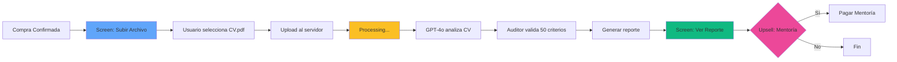

# 🚀 User Journey - SkillsForIT Platform

**Flujo Completo del Proceso de Usuario**

---

## 📊 Diagrama de Flujo General

```mermaid
flowchart TD
    Start([Usuario llega a la plataforma]) --> Landing[Landing Page]
    
    Landing --> Form[Formulario de Perfil]
    Form --> |Completa| Data[País + Profesión + Propósito]
    
    Data --> Cart[Carrito de Compras]
    Cart --> MainItem[Auditoría CV: $7 USD]
    
    MainItem --> OrderBump{Order Bump: E-book?}
    OrderBump --> |Sí| AddEbook[Total: $12 USD]
    OrderBump --> |No| SkipEbook[Total: $7 USD]
    
    AddEbook --> Stripe[Stripe Payment Screen]
    SkipEbook --> Stripe
    
    Stripe --> Payment{Pago Aprobado?}
    Payment --> |No| PaymentFail[Error de Pago]
    PaymentFail --> Stripe
    
    Payment --> |Sí| Confirmation[Confirmación de Compra]
    Confirmation --> Email[Email Automático]
    Email --> |Envía| EmailContent[Acceso + Instrucciones]
    
    Confirmation --> Database[(Database)]
    Database --> Segment[Segmento: Comprador_CV]
    
    Segment --> PostPurchase{Tipo de Compra}
    
    PostPurchase --> |CV Analysis| UploadScreen[Screen: Subir Archivo]
    UploadScreen --> FileUpload[Usuario sube CV.pdf]
    FileUpload --> Processing[Procesamiento con IA]
    Processing --> |GPT-4o + Auditor| Analysis[Análisis Completo]
    Analysis --> Report[Ver Reporte de 50 Criterios]
    
    PostPurchase --> |Mentorship| Dashboard[Dashboard IT]
    Dashboard --> Browse[Explorar Mentores]
    Browse --> BookButton[Botón: Reservar mi primera sesión de 10min]
    BookButton --> Calendar[Calendario de Disponibilidad]
    Calendar --> Booking[Confirmar Reserva]
    Booking --> CreditDeduct[Deducir 1 de 4 créditos mensuales]
    CreditDeduct --> MentorNotify[Notificar al Mentor]
    
    Report --> Upsell1{Upsell: Mentoría}
    Upsell1 --> |Sí| Dashboard
    Upsell1 --> |No| End1([Fin del Journey])
    
    MentorNotify --> Session[Sesión de Mentoría]
    Session --> Feedback[Feedback y Comentarios]
    Feedback --> Sentiment[Análisis de Sentimiento]
    Sentiment --> End2([Fin del Journey])
    
    EmailContent --> End3([Usuario recibe acceso])

    style Start fill:#a78bfa
    style Landing fill:#60a5fa
    style Cart fill:#34d399
    style Stripe fill:#fbbf24
    style Confirmation fill:#10b981
    style Database fill:#ec4899
    style Report fill:#8b5cf6
    style Dashboard fill:#3b82f6
    style End1 fill:#6366f1
    style End2 fill:#6366f1
    style End3 fill:#6366f1
```



---

## 🎯 Desglose por Etapa

### 1️⃣ Landing Page

**Objetivo**: Capturar información del usuario y calificar leads

**Campos del Formulario**:
- 🌍 **País**: Dropdown con países (analytics por región)
- 💼 **Profesión**: Dropdown con roles IT (Junior, Transition, Leadership)
- 🎯 **Propósito**: Textarea libre (¿Qué buscas mejorar?)

**Tracking**:
```typescript
trackEvent('landing_view', {
  country: 'Argentina',
  profession: 'Software Engineer',
  purpose: 'Mejorar mi CV para conseguir trabajo remoto'
})
```

**Archivo**: `app/page.tsx`

---

### 2️⃣ Carrito de Compras

**Item Principal**:
- 📄 **Auditoría de CV con IA**
- Precio: **$7 USD**
- Incluye: Análisis de 50 criterios + Reporte detallado

**Order Bump (Check Impulsivo)**:
- 📚 **E-book: "10 Errores Comunes en CVs IT"**
- Precio: **+$5 USD**
- Checkbox: "¿Agregar E-book a mi compra?"

**Total**:
- Sin E-book: **$7 USD**
- Con E-book: **$12 USD**

**Tracking**:
```typescript
trackEvent('cv_upload_start', { hasEbook: true })
```

**Archivo**: `app/cart/page.tsx`

---

### 3️⃣ Stripe Payment Screen

**Proceso**:
1. Usuario ingresa datos de tarjeta
2. Stripe valida y procesa pago
3. Webhook recibe confirmación

**Tracking**:
```typescript
// Inicio de pago
trackEvent('payment_initiated', {
  amount: 12,
  items: ['cv_analysis', 'ebook']
})

// Pago completado
trackEvent('payment_completed', {
  amount: 12,
  stripePaymentId: 'pi_xxx'
})
```

**Archivos**:
- `app/api/checkout/route.ts`: Crear Stripe checkout session
- `app/api/webhook/route.ts`: Procesar confirmación de pago

---

### 4️⃣ Confirmación y Email Automático

**Email Template**:
```
Asunto: ✅ Tu Auditoría de CV está lista para empezar

Hola [Nombre],

Gracias por tu compra. Aquí tienes tu acceso:

🔗 Subir CV: https://skillsforit.com/upload
📧 Tu email registrado: [email]

[Si compró E-book]
📚 Descargar E-book: [link de descarga]

Próximos pasos:
1. Sube tu CV en formato PDF
2. Espera 2-3 minutos mientras la IA lo analiza
3. Recibe tu reporte con 50 criterios evaluados

¿Necesitas ayuda? Responde a este email.

Saludos,
Equipo SkillsForIT
```

**Tracking**:
```typescript
trackEvent('confirmation_email_sent', {
  email: 'user@example.com',
  purchaseType: 'cv_analysis',
  hasEbook: true
})
```

**Archivo**: `app/api/webhook/route.ts` (envío de email tras webhook)

---

### 5️⃣ Database - Segmentación

**Segmento Creado**: `Comprador_CV`

**Datos Guardados**:
```typescript
interface Purchase {
  userId: string
  email: string
  country: string
  profession: string
  purpose: string
  purchaseDate: Date
  items: ['cv_analysis', 'ebook'?]
  amount: number
  stripePaymentId: string
  segment: 'Comprador_CV'
}
```

**Revenue Tracking**:
```typescript
// En revenueDb
{
  userId: '123',
  amount: 12,
  source: 'cv_analysis',
  date: '2026-01-10',
  country: 'Argentina'
}
```

**Archivo**: `lib/db.ts`

---

## 🔀 Post-Compra: Dos Caminos

### Camino A: Compró CV Analysis



**Flujo Detallado**:

1. **Screen: Subir Archivo**
   - Botón: "Subir mi CV"
   - Formatos aceptados: PDF, DOCX
   - Tamaño máximo: 5 MB
   - **Tracking**: `trackEvent('cv_upload_start')`

2. **Usuario sube CV**
   - Drag & drop o file picker
   - Progress bar de upload
   - **Tracking**: `trackEvent('cv_upload_complete')`

3. **Procesamiento con IA**
   - Loading spinner: "Analizando tu CV..."
   - Tiempo estimado: 2-3 minutos
   - **Backend**: 
     - Extracción de texto con `pdf-parse`
     - Análisis con GPT-4o
     - Auditoría de 50 criterios

4. **Ver Reporte**
   - Diseño con tabs:
     - ✅ Fortalezas (criterios aprobados)
     - ⚠️ Debilidades (criterios rechazados)
     - 💡 Recomendaciones (sugerencias de mejora)
   - Score final: X/50
   - **Tracking**: `trackEvent('analysis_viewed')`

5. **Upsell: Mentoría**
   - Banner: "¿Necesitas ayuda personalizada?"
   - CTA: "Reservar Mentoría con Experto"
   - Precio: $25 USD (4 sesiones/mes)

**Archivos**:
- `app/upload/page.tsx`: UI de upload
- `app/api/upload/route.ts`: Backend upload
- `app/api/analyze/route.ts`: Análisis con IA
- `lib/ai-analysis.ts`: GPT-4o integration
- `lib/cv-auditor.ts`: 50 criterios de evaluación
- `app/report/page.tsx`: Visualización de reporte

---

### Camino B: Compró Mentoría


**Flujo Detallado**:

1. **Dashboard IT**
   - Panel con 4 secciones:
     - 📊 Mis Créditos: 4/4 disponibles
     - 📅 Próximas Mentorías: (vacío)
     - 👥 Mentores Recomendados
     - 📈 Mi Progreso
   - **Tracking**: `trackEvent('mentorship_dashboard_view')`

2. **Botón: Reservar mi primera sesión**
   - CTA prominente en la parte superior
   - Click → `trackEvent('mentorship_browse')`

3. **Explorar Mentores**
   - Filtros:
     - Especialidad (Frontend, Backend, DevOps, etc.)
     - Experiencia (5-10 años, 10+ años)
     - Idioma (Español, Inglés)
   - Cards de mentores con:
     - Foto
     - Nombre
     - Título (Senior Engineer @ Google)
     - Rating (4.8 ⭐)
     - Precio por sesión (incluido en plan)

4. **Seleccionar Mentor**
   - Ver perfil completo
   - Leer reviews de otros usuarios
   - Ver disponibilidad en tiempo real

5. **Calendario de Disponibilidad**
   - Vista semanal con slots de 10 minutos
   - Horarios en zona horaria del usuario
   - Slots disponibles en verde, ocupados en gris

6. **Confirmar Reserva**
   - Modal de confirmación:
     - Mentor: [Nombre]
     - Fecha: [DD/MM/YYYY]
     - Hora: [HH:MM]
     - Duración: 10 minutos
     - Créditos a usar: 1 de 4
   - Botón: "Confirmar Reserva"
   - **Tracking**: `trackEvent('mentorship_booked')`

7. **Deducción de Créditos**
   - Sistema valida créditos disponibles
   - Deduce 1 crédito
   - Actualiza contador: 3/4 disponibles

8. **Notificaciones**
   - **Email al Mentor**:
     ```
     Nueva reserva confirmada
     
     Usuario: [Nombre]
     Fecha: [DD/MM/YYYY] a las [HH:MM]
     Duración: 10 minutos
     Tema: [Propósito del usuario]
     
     Unirse a la llamada: [Google Meet link]
     ```
   
   - **Email al Usuario**:
     ```
     Tu mentoría está confirmada
     
     Mentor: [Nombre] - [Título]
     Fecha: [DD/MM/YYYY] a las [HH:MM]
     
     Preparación recomendada:
     - Ten tu CV a mano
     - Prepara 2-3 preguntas específicas
     - Conéctate 2 minutos antes
     
     Unirse: [Google Meet link]
     ```

9. **Sesión de Mentoría**
   - Llamada de 10 minutos vía Google Meet
   - Usuario y mentor se conectan
   - **Tracking**: `trackEvent('mentorship_started')`

10. **Feedback Post-Sesión**
    - Formulario para usuario:
      - Rating: 1-5 estrellas
      - Comentario: Textarea libre
      - ¿Fue útil?: Sí/No
    - **Tracking**: `trackEvent('mentorship_completed')`

11. **Análisis de Sentimiento**
    - Backend analiza comentario con NLP
    - Detecta soft skills mencionadas:
      - Comunicación
      - Empatía
      - Conocimiento técnico
      - Puntualidad
      - etc.
    - Almacena en base de datos para analytics

**Archivos**:
- `app/mentorship/page.tsx`: Dashboard de mentoría
- `app/mentorship/calendar/page.tsx`: Calendario de mentores
- `app/api/mentorship/book/route.ts`: Reservar sesión
- `lib/session-credits.ts`: Sistema de créditos
- `lib/sentiment-analysis.ts`: Análisis de comentarios
- `app/api/analytics/soft-skills/route.ts`: Analytics de sentimiento

---

## 📊 Tracking de Analytics

### Eventos del Funnel

```typescript
// 1. Landing
trackEvent('landing_view', { country, profession, purpose })

// 2. Inicio de carga CV
trackEvent('cv_upload_start', { hasEbook })

// 3. CV subido
trackEvent('cv_upload_complete', { filename, size })

// 4. Inicio de pago
trackEvent('payment_initiated', { amount, items })

// 5. Pago completado
trackEvent('payment_completed', { amount, stripePaymentId })

// 6. Resultados vistos
trackEvent('analysis_viewed', { score, weaknesses })

// 7. Exploración de mentores
trackEvent('mentorship_browse', { filters })

// 8. Mentoría reservada
trackEvent('mentorship_booked', { mentorId, date })

// 9. Mentoría completada
trackEvent('mentorship_completed', { mentorId, rating })
```

### Conversiones Clave

| Etapa | Conversión Esperada |
|-------|---------------------|
| Landing → Upload | 45% |
| Upload → Payment | 35% |
| Payment → Analysis | 100% (automático) |
| Analysis → View | 90% |
| View → Upsell | 15% |
| Mentorship Browse → Book | 60% |
| Book → Complete | 85% |

---

## 💰 Revenue Tracking

### Por Producto

```typescript
interface RevenueEvent {
  userId: string
  amount: number
  source: 'cv_analysis' | 'ebook' | 'mentorship'
  date: Date
  country: string
}

// Ejemplo
revenueDb.push({
  userId: '123',
  amount: 7,
  source: 'cv_analysis',
  date: new Date('2026-01-10'),
  country: 'Argentina'
})

revenueDb.push({
  userId: '123',
  amount: 5,
  source: 'ebook',
  date: new Date('2026-01-10'),
  country: 'Argentina'
})
```

### LTV Calculation

```typescript
// Por segmento
interface UserLTV {
  segment: 'Junior' | 'Transition' | 'Leadership'
  averageRevenue: number
  churnRate: number
  lifetimeMonths: number
  ltv: number // monthlyRevenue × (1 / churnRate)
}

// Ejemplo: Leadership
{
  segment: 'Leadership',
  averageRevenue: 180, // $180/mes
  churnRate: 0.12,     // 12% churn
  lifetimeMonths: 8.33, // 1 / 0.12
  ltv: 1500            // $180 × 8.33
}
```

---

## 🔐 Segmentación de Usuarios

### Segmentos Principales

1. **Visitor** (no registrado)
   - Vio landing page
   - No completó compra
   - Target: Remarketing

2. **Comprador_CV** (compró solo CV)
   - Pagó $7 (+ $5 si E-book)
   - Subió CV
   - Target: Upsell mentoría

3. **Comprador_Mentoría** (compró mentoría)
   - Pagó $25/mes
   - 4 créditos mensuales
   - Target: Renovación automática

4. **Power User** (ambos)
   - Compró CV + Mentoría
   - Engagement alto
   - Target: Referral program

### Comunicación por Segmento

| Segmento | Email 1 | Email 2 | Email 3 |
|----------|---------|---------|---------|
| **Visitor** | Welcome + Descuento 20% | Testimonios | Urgencia (24h) |
| **Comprador_CV** | Instrucciones upload | Reporte listo | Upsell mentoría |
| **Comprador_Mentoría** | Bienvenida + Reserva | Recordatorio sesión | Feedback post-sesión |
| **Power User** | Tips avanzados | Invita a amigos | Renovación automática |

---

## 🎨 Wireframes de Screens Clave

### Screen 1: Landing Page

```
+--------------------------------------------------+
|  [Logo SkillsForIT]          [Login] [Sign Up]  |
+--------------------------------------------------+
|                                                  |
|          🚀 Impulsa tu Carrera IT                |
|                                                  |
|     Análisis de CV con IA + Mentoría Experta    |
|                                                  |
|  +--------------------------------------------+  |
|  | 🌍 País:        [Dropdown ▼]               |  |
|  | 💼 Profesión:   [Dropdown ▼]               |  |
|  | 🎯 Propósito:   [Textarea...             ] |  |
|  |                                            |  |
|  |        [Analizar mi CV - $7 USD]  →       |  |
|  +--------------------------------------------+  |
|                                                  |
|  ✅ 50 Criterios Evaluados                       |
|  ✅ Reporte en 3 Minutos                         |
|  ✅ Recomendaciones Personalizadas               |
+--------------------------------------------------+
```

### Screen 2: Carrito con Order Bump

```
+--------------------------------------------------+
|               🛒 Tu Carrito                      |
+--------------------------------------------------+
|                                                  |
|  📄 Auditoría de CV con IA                       |
|     • 50 criterios evaluados                     |
|     • Reporte detallado                     $7   |
|                                                  |
|  +--------------------------------------------+  |
|  | ✅ [Agregar E-book "10 Errores Comunes"]   |  |
|  |    📚 Bonus: Guía de 20 páginas       +$5  |  |
|  +--------------------------------------------+  |
|                                                  |
|  Subtotal:                                  $12  |
|  Procesamiento:                            FREE  |
|  ─────────────────────────────────────────────   |
|  Total:                                     $12  |
|                                                  |
|          [Proceder al Pago] →                    |
+--------------------------------------------------+
```

### Screen 3: Subir CV (Post-Compra)

```
+--------------------------------------------------+
|  ← Volver    Subir tu CV                         |
+--------------------------------------------------+
|                                                  |
|               📄 Subir tu CV                     |
|                                                  |
|  +--------------------------------------------+  |
|  |                                            |  |
|  |         [Arrastre archivo aquí]            |  |
|  |                   o                        |  |
|  |          [Seleccionar archivo]             |  |
|  |                                            |  |
|  |     Formatos: PDF, DOCX (Max 5MB)         |  |
|  +--------------------------------------------+  |
|                                                  |
|  Archivos subidos:                               |
|  • CV_Juan_Perez.pdf (850 KB) ✅                 |
|                                                  |
|          [Analizar con IA] →                     |
|                                                  |
|  ⏱️ Tiempo estimado: 2-3 minutos                 |
+--------------------------------------------------+
```

### Screen 4: Dashboard Mentoría

```
+--------------------------------------------------+
|  [Logo]  Dashboard  Mentores  Perfil  [Logout]  |
+--------------------------------------------------+
|                                                  |
|  Hola, Juan 👋                                   |
|                                                  |
|  +------------------+  +---------------------+   |
|  | 📊 Mis Créditos  |  | 📅 Próximas Sesiones|   |
|  |                  |  |                     |   |
|  |   4/4 🟢         |  |  No hay reservas    |   |
|  |   Disponibles    |  |                     |   |
|  |                  |  |  [Reservar ahora]   |   |
|  +------------------+  +---------------------+   |
|                                                  |
|  👥 Mentores Recomendados                        |
|                                                  |
|  +--------------------------------------------+  |
|  | 👤 María González                          |  |
|  | Senior Backend @ Google                    |  |
|  | ⭐ 4.9 (127 reviews)                       |  |
|  | [Ver Calendario] →                         |  |
|  +--------------------------------------------+  |
|                                                  |
|  [+ Ver más mentores]                            |
+--------------------------------------------------+
```

---

## 🚦 Estados de Error y Edge Cases

### Error 1: Pago Rechazado

**Trigger**: Stripe rechaza tarjeta

**Handling**:
1. Mostrar mensaje: "Tu pago no pudo procesarse. Por favor verifica tus datos de tarjeta."
2. Botón: "Intentar nuevamente"
3. Link: "¿Necesitas ayuda? Contacta soporte"
4. **Tracking**: `trackEvent('payment_failed', { reason: 'card_declined' })`

### Error 2: CV Corrupto

**Trigger**: Archivo PDF no se puede parsear

**Handling**:
1. Validar extensión y MIME type
2. Si falla: "El archivo no pudo ser leído. Asegúrate de subir un PDF válido."
3. Botón: "Subir otro archivo"
4. **Tracking**: `trackEvent('upload_error', { reason: 'corrupted_pdf' })`

### Error 3: Sin Créditos

**Trigger**: Usuario intenta reservar sin créditos

**Handling**:
1. Modal: "Has usado tus 4 créditos mensuales"
2. Opción 1: "Esperar renovación" (mostrar fecha)
3. Opción 2: "Comprar pack adicional" ($10 por 2 créditos)
4. **Tracking**: `trackEvent('credits_depleted', { action: 'blocked_booking' })`

### Error 4: Mentor No Disponible

**Trigger**: Slot reservado entre vista y confirmación

**Handling**:
1. Refresh automático del calendario
2. Mensaje: "Este horario ya fue reservado. Por favor elige otro."
3. Resaltar slots disponibles
4. **Tracking**: `trackEvent('booking_conflict', { mentorId, slot })`

---

## 📈 Métricas de Éxito

### KPIs Principales

| Métrica | Objetivo | Actual |
|---------|----------|--------|
| **Conversión Landing → Pago** | 30% | - |
| **Conversión CV → Mentoría** | 15% | - |
| **NPS (Net Promoter Score)** | 50+ | - |
| **Churn Rate Mensual** | <15% | - |
| **LTV Promedio** | $120 | - |
| **Tiempo Promedio a Primera Mentoría** | <48h | - |

### Dashboard de Métricas

Acceso: `/ceo/dashboard`

**Visualizaciones**:
- 📊 Funnel de conversión (9 etapas)
- 💰 Revenue por segmento (Junior/Transition/Leadership)
- 📈 Proyecciones (Realista vs Optimista)
- 👥 LTV por tipo de usuario
- 🌍 Conversión por país
- 🎯 Soft skills más mencionadas

---

## ✅ Checklist de Implementación

### Frontend
- [x] Landing page con formulario
- [x] Carrito con order bump
- [x] Integración Stripe checkout
- [x] Página de confirmación
- [x] Upload de CV con drag & drop
- [x] Visualización de reporte
- [x] Dashboard de mentoría
- [x] Calendario de mentores
- [x] Formulario de feedback

### Backend
- [x] API de checkout (`/api/checkout`)
- [x] Webhook de Stripe (`/api/webhook`)
- [x] API de upload (`/api/upload`)
- [x] API de análisis (`/api/analyze`)
- [x] API de booking (`/api/mentorship/book`)
- [x] Sistema de créditos (`SessionCreditsManager`)
- [x] Análisis de sentimiento (`sentiment-analysis.ts`)
- [x] Analytics endpoints (funnel, LTV, projections)

### Testing
- [x] E2E tests del flujo completo
- [x] Tests de seguridad (role isolation)
- [x] Tests de Stripe webhook
- [x] Tests de análisis de CV
- [x] Tests de sistema de créditos

### DevOps
- [ ] Deploy a producción
- [ ] Configurar Stripe webhooks en production
- [ ] Configurar email transaccional (SendGrid/Mailgun)
- [ ] Configurar analytics (Google Analytics / Mixpanel)
- [ ] Configurar monitoring (Sentry)

---

## 🔮 Próximas Mejoras

### Q1 2026
- [ ] Recordatorios automáticos 24h antes de mentoría
- [ ] Sistema de referidos (invita amigo, gana 1 crédito)
- [ ] Planes anuales con descuento
- [ ] Integración Calendly para mentores
- [ ] App móvil (React Native)

### Q2 2026
- [ ] IA que sugiere mentores según perfil
- [ ] Análisis de LinkedIn profile (además de CV)
- [ ] Comunidad privada de usuarios
- [ ] Certificados de mentoría completada
- [ ] Marketplace de servicios adicionales

---

**Última actualización**: Enero 10, 2026  
**Versión**: 1.0  
**Mantenido por**: Equipo SkillsForIT
