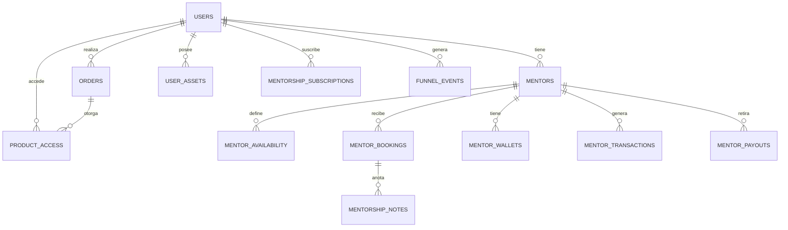

# DER - Diagrama Entidad Relación

```mermaid
erDiagram
    USERS ||--o{ MENTORS : "tiene"
    USERS ||--o{ ORDERS : "realiza"
    USERS ||--o{ PRODUCT_ACCESS : "accede"
    USERS ||--o{ USER_ASSETS : "posee"
    MENTORS ||--o{ MENTOR_AVAILABILITY : "define"
    MENTORS ||--o{ MENTOR_BOOKINGS : "recibe"
    MENTORS ||--o{ MENTOR_WALLETS : "tiene"
    MENTORS ||--o{ MENTOR_TRANSACTIONS : "genera"
    MENTORS ||--o{ MENTOR_PAYOUTS : "retira"
    MENTOR_BOOKINGS ||--o{ MENTORSHIP_NOTES : "anota"
    ORDERS ||--o{ PRODUCT_ACCESS : "otorga"
    USERS ||--o{ MENTORSHIP_SUBSCRIPTIONS : "suscribe"
    USERS ||--o{ FUNNEL_EVENTS : "genera"
```
