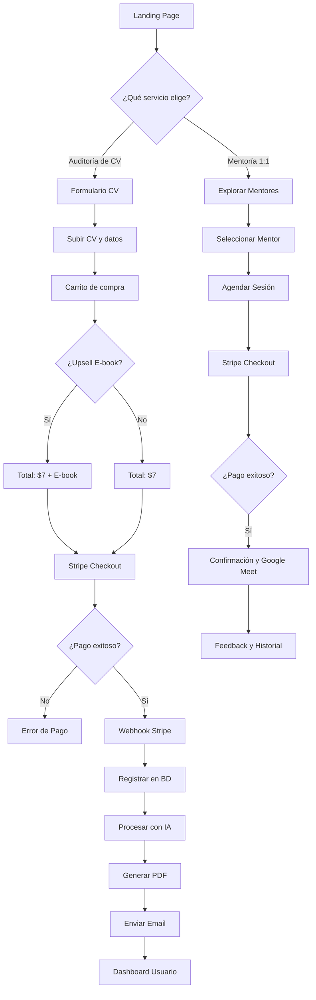

# Diagrama Visual de Flujo de Usuario

```mermaid
flowchart TD
    A[Landing Page] --> B{¿Qué servicio elige?}
    B -->|Auditoría de CV| C[Formulario CV]
    B -->|Mentoría 1:1| D[Explorar Mentores]
    C --> E[Subir CV y datos]
    E --> F[Carrito de compra]
    F --> G{¿Upsell E-book?}
    G -->|Sí| H[Total: $7 + E-book]
    G -->|No| I[Total: $7]
    H --> J[Stripe Checkout]
    I --> J
    J --> K{¿Pago exitoso?}
    K -->|No| L[Error de Pago]
    K -->|Sí| M[Webhook Stripe]
    M --> N[Registrar en BD]
    N --> O[Procesar con IA]
    O --> P[Generar PDF]
    P --> Q[Enviar Email]
    Q --> R[Dashboard Usuario]
    D --> S[Seleccionar Mentor]
    S --> T[Agendar Sesión]
    T --> U[Stripe Checkout]
    U --> V{¿Pago exitoso?}
    V -->|Sí| W[Confirmación y Google Meet]
    W --> X[Feedback y Historial]
```
