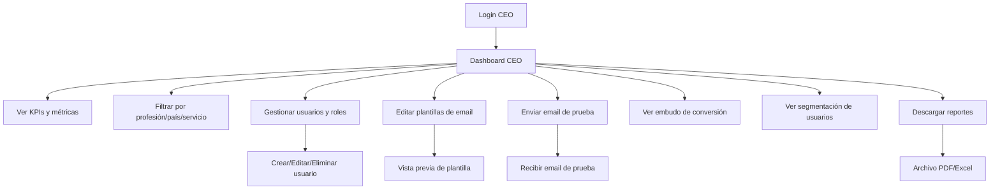

# Diagrama de Flujo - Usuario CEO

```mermaid
flowchart TD
    A[Login CEO] --> B[Dashboard CEO]
    B --> C[Ver KPIs y métricas]
    B --> D[Filtrar por profesión/país/servicio]
    B --> E[Gestionar usuarios y roles]
    B --> F[Editar plantillas de email]
    B --> G[Enviar email de prueba]
    B --> H[Ver embudo de conversión]
    B --> I[Ver segmentación de usuarios]
    B --> J[Descargar reportes]
    E --> K[Crear/Editar/Eliminar usuario]
    F --> L[Vista previa de plantilla]
    G --> M[Recibir email de prueba]
    J --> N[Archivo PDF/Excel]
```
