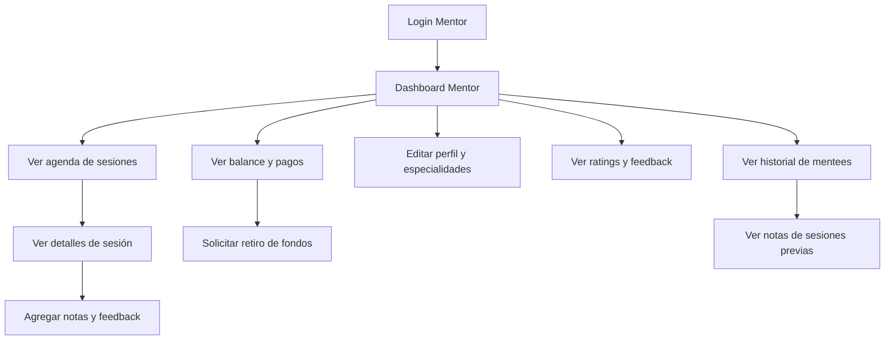

# Diagrama de Flujo - Usuario Mentor

```mermaid
flowchart TD
    A[Login Mentor] --> B[Dashboard Mentor]
    B --> C[Ver agenda de sesiones]
    B --> D[Ver historial de mentees]
    B --> E[Editar perfil y especialidades]
    B --> F[Ver ratings y feedback]
    B --> G[Ver balance y pagos]
    C --> H[Ver detalles de sesión]
    H --> I[Agregar notas y feedback]
    G --> J[Solicitar retiro de fondos]
    D --> K[Ver notas de sesiones previas]
```
