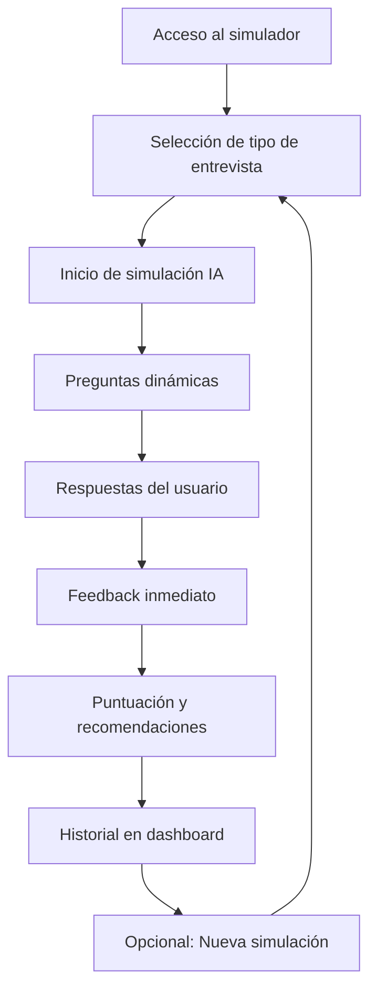

# Diagrama de Flujo: Simulador de Entrevista Técnica

```mermaid
flowchart TD
    A[Acceso al simulador] --> B[Selección de tipo de entrevista]
    B --> C[Inicio de simulación IA]
    C --> D[Preguntas dinámicas]
    D --> E[Respuestas del usuario]
    E --> F[Feedback inmediato]
    F --> G[Puntuación y recomendaciones]
    G --> H[Historial en dashboard]
    H --> I[Opcional: Nueva simulación]
    I --> B
```
