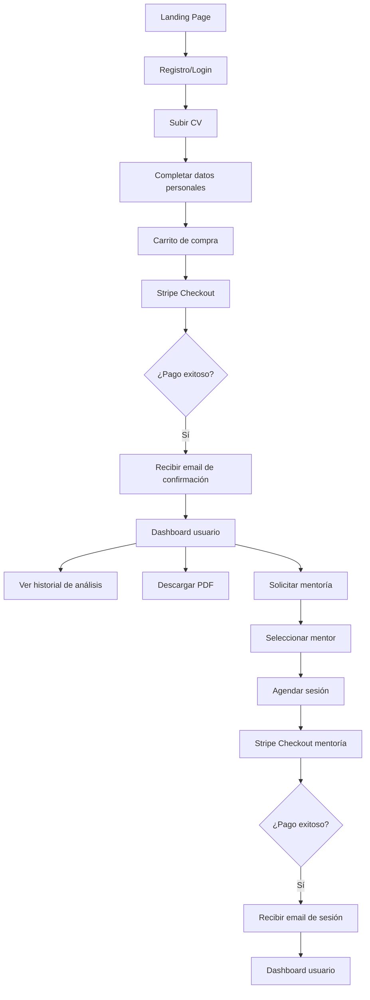

# Diagrama de Flujo - Usuario IT

```mermaid
flowchart TD
    A[Landing Page] --> B[Registro/Login]
    B --> C[Subir CV]
    C --> D[Completar datos personales]
    D --> E[Carrito de compra]
    E --> F[Stripe Checkout]
    F --> G{¿Pago exitoso?}
    G -->|Sí| H[Recibir email de confirmación]
    H --> I[Dashboard usuario]
    I --> J[Ver historial de análisis]
    I --> K[Descargar PDF]
    I --> L[Solicitar mentoría]
    L --> M[Seleccionar mentor]
    M --> N[Agendar sesión]
    N --> O[Stripe Checkout mentoría]
    O --> P{¿Pago exitoso?}
    P -->|Sí| Q[Recibir email de sesión]
    Q --> R[Dashboard usuario]
```
