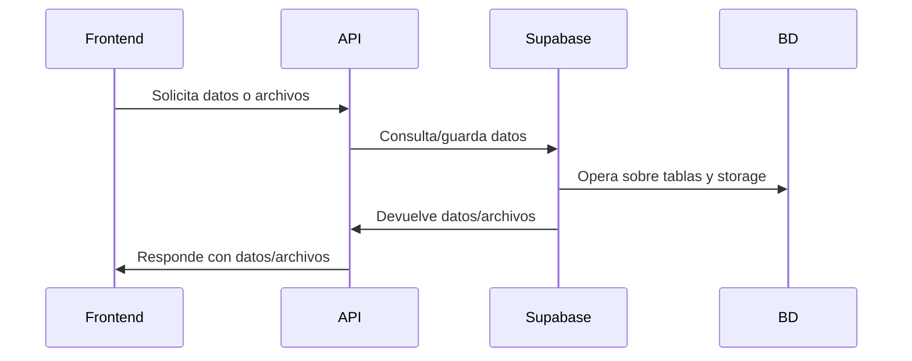

# Diagrama de Integración Externa: Supabase

```mermaid
sequenceDiagram
    participant Frontend
    participant API
    participant Supabase
    participant BD
    Frontend->>API: Solicita datos o archivos
    API->>Supabase: Consulta/guarda datos
    Supabase->>BD: Opera sobre tablas y storage
    Supabase->>API: Devuelve datos/archivos
    API->>Frontend: Responde con datos/archivos
```
