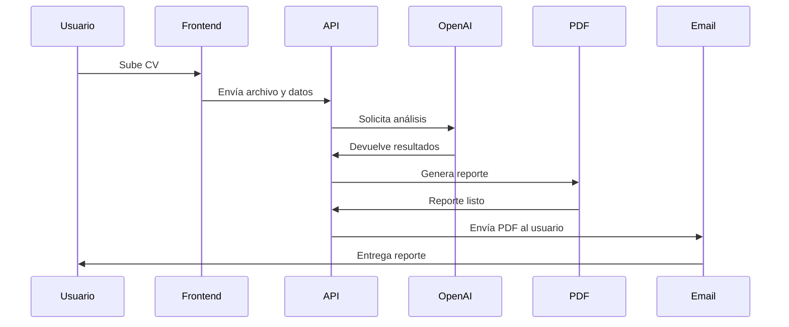

# Diagrama de Proceso Interno: Análisis de CV con IA

```mermaid
sequenceDiagram
    participant Usuario
    participant Frontend
    participant API
    participant OpenAI
    participant PDF
    participant Email
    Usuario->>Frontend: Sube CV
    Frontend->>API: Envía archivo y datos
    API->>OpenAI: Solicita análisis
    OpenAI->>API: Devuelve resultados
    API->>PDF: Genera reporte
    PDF->>API: Reporte listo
    API->>Email: Envía PDF al usuario
    Email->>Usuario: Entrega reporte
```
