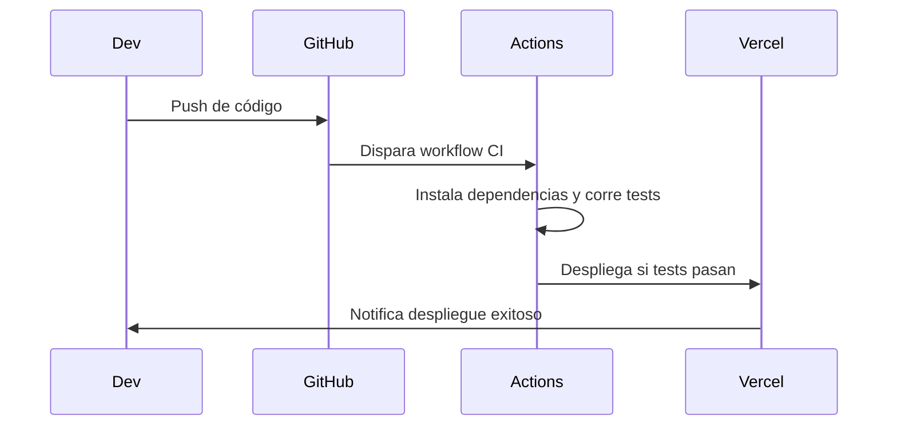

# Diagrama de Proceso Interno: CI/CD y Despliegue

```mermaid
sequenceDiagram
    participant Dev
    participant GitHub
    participant Actions
    participant Vercel
    Dev->>GitHub: Push de código
    GitHub->>Actions: Dispara workflow CI
    Actions->>Actions: Instala dependencias y corre tests
    Actions->>Vercel: Despliega si tests pasan
    Vercel->>Dev: Notifica despliegue exitoso
```
