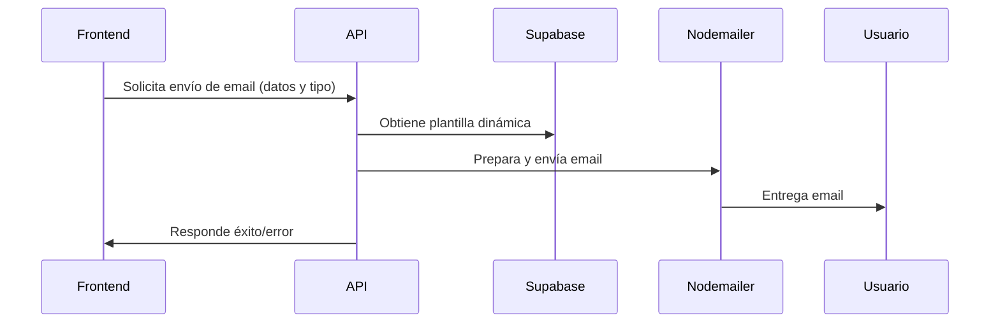

# Diagrama de Proceso Interno: Envío de Email Transaccional

```mermaid
sequenceDiagram
    participant Frontend
    participant API
    participant Supabase
    participant Nodemailer
    participant Usuario
    Frontend->>API: Solicita envío de email (datos y tipo)
    API->>Supabase: Obtiene plantilla dinámica
    API->>Nodemailer: Prepara y envía email
    Nodemailer->>Usuario: Entrega email
    API->>Frontend: Responde éxito/error
```
