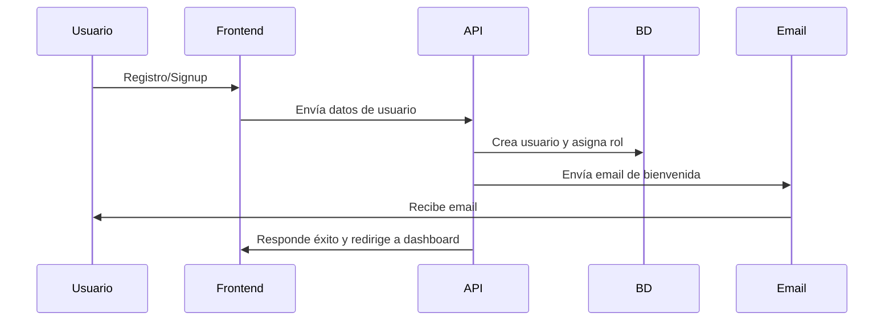

# Diagrama de Proceso Interno: Onboarding de Usuario

```mermaid
sequenceDiagram
    participant Usuario
    participant Frontend
    participant API
    participant BD
    participant Email
    Usuario->>Frontend: Registro/Signup
    Frontend->>API: Envía datos de usuario
    API->>BD: Crea usuario y asigna rol
    API->>Email: Envía email de bienvenida
    Email->>Usuario: Recibe email
    API->>Frontend: Responde éxito y redirige a dashboard
```
