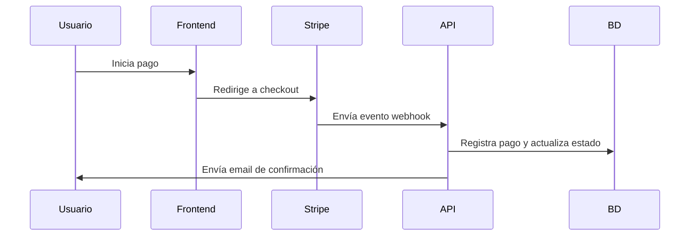

# Diagrama de Proceso Interno: Pago y Webhook Stripe

```mermaid
sequenceDiagram
    participant Usuario
    participant Frontend
    participant Stripe
    participant API
    participant BD
    Usuario->>Frontend: Inicia pago
    Frontend->>Stripe: Redirige a checkout
    Stripe->>API: Envía evento webhook
    API->>BD: Registra pago y actualiza estado
    API->>Usuario: Envía email de confirmación
```
