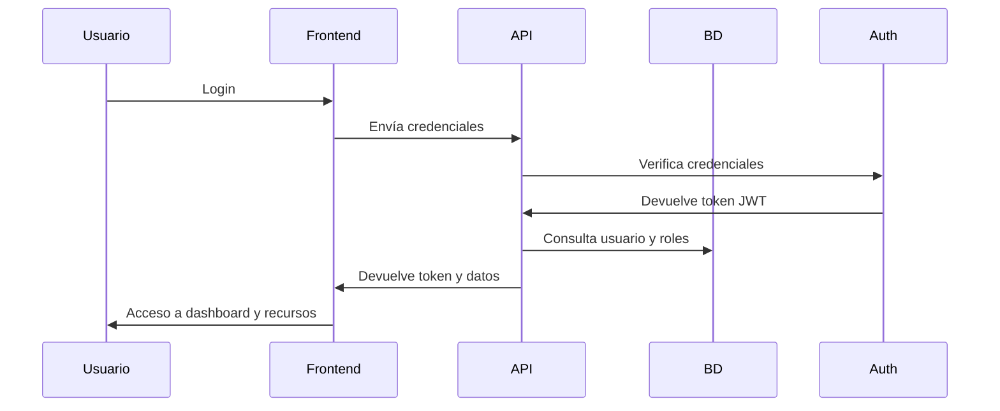

# Diagrama de Proceso Interno: Seguridad y Autenticación

```mermaid
sequenceDiagram
    participant Usuario
    participant Frontend
    participant API
    participant BD
    participant Auth
    Usuario->>Frontend: Login
    Frontend->>API: Envía credenciales
    API->>Auth: Verifica credenciales
    Auth->>API: Devuelve token JWT
    API->>BD: Consulta usuario y roles
    API->>Frontend: Devuelve token y datos
    Frontend->>Usuario: Acceso a dashboard y recursos
```
